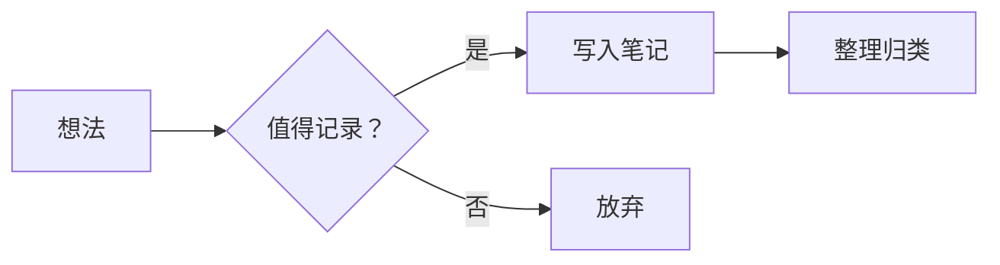

# 欢迎来到我的笔记

> 好记性不如烂笔头。

这是我的个人知识库，用于记录学习笔记、技术总结和日常思考。

---

## 快速导航

<div class="grid cards" markdown>

-   :material-notebook-outline: **笔记**

    ---

    学习笔记与知识整理

    [:octicons-arrow-right-24: 浏览笔记](notes/index.md)

-   :material-information-outline: **关于**

    ---

    关于本站的说明

    [:octicons-arrow-right-24: 了解更多](about.md)

</div>

---

## 本站特性

- **全文搜索**：支持中英文搜索
- **数学公式**：支持 $\LaTeX$ 渲染，例如 $E = mc^2$
- **代码高亮**：支持多种编程语言
- **深色模式**：跟随系统或手动切换
- **流程图**：支持 Mermaid 图表

## 示例

### 代码块

```python title="hello.py"
def greet(name: str) -> str:
    """返回问候语"""
    return f"你好，{name}！"

print(greet("世界"))
```

### 流程图



### 数学公式

$$
\int_{-\infty}^{+\infty} e^{-x^2} \, dx = \sqrt{\pi}
$$

### 提示框

!!! tip "提示"
    使用左上角的搜索框可以快速找到笔记。

!!! note "说明"
    本站使用 [MkDocs](https://www.mkdocs.org/) + [Material 主题](https://squidfunk.github.io/mkdocs-material/) 构建。
