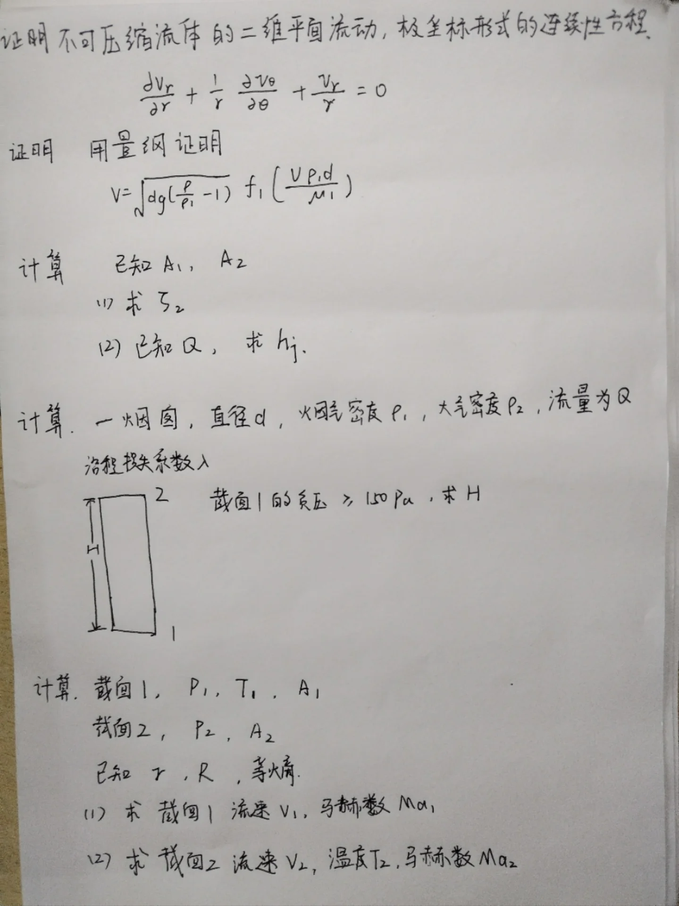
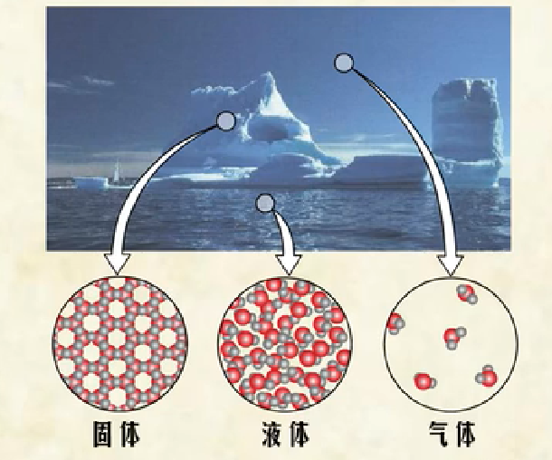
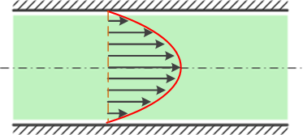
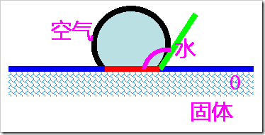
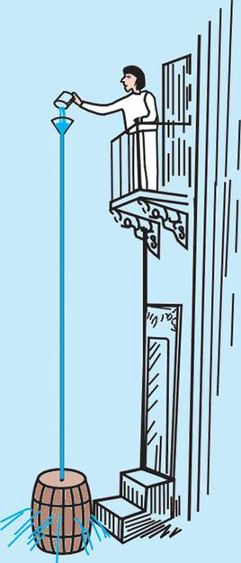
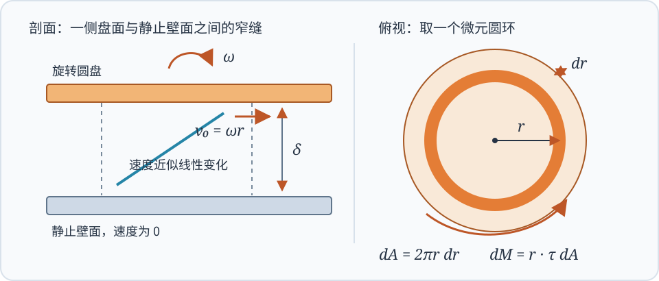
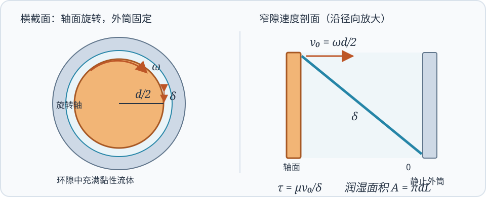
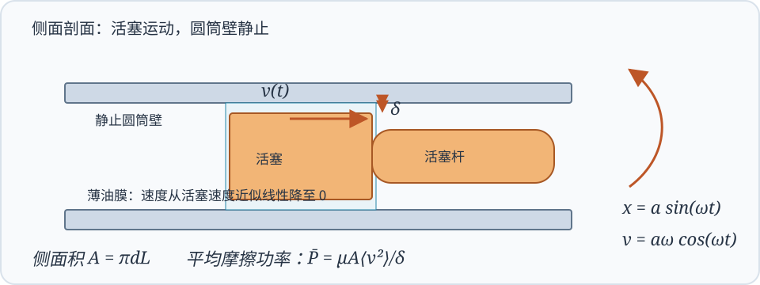

# 工程流体力学（甲）Ⅰ

!!! note "课程信息"
    - **主讲教师**：俞自涛、范利武
    - **教材**：孔珑主编《工程流体力学（第四版）》，中国电力出版社
    - **课程范围**：流体性质、流体静力学、理想流体动力学、黏性流动、可压缩一维流动、量纲分析与相似原理
    - **考核方式**：期末考试 60%；平时成绩 40%（作业、阅读和课堂测验）。此项按 2026 年秋季教学指南记录。

工程流体力学研究流体的静止、运动及其与固体之间的作用。管道阻力、泵与风机的功耗、喷管流量、机翼和球体受到的力，都可以沿着同一条思路分析：先选取流体模型，再写质量、动量和能量守恒关系，最后用材料性质与边界条件确定未知量。

本页按《工程流体力学（甲）Ⅰ》的六章教学提纲编排。例题按课程范围放在相应章节，注明是作业、课件题、[手写回忆卷](#fluid-i-recall)还是自拟演示题。

## 核心手写讲义原稿 { #fluid-handwritten-sources }

以下四份是本讲义**前三章的主要课堂依据**。正文将原稿里中英文交错的术语、图和推导改写为中文；想核对老师的列式顺序、图示或旁注时，可打开对应 PDF 原页。PDF 页码均指文件阅读器显示的页码。

| 手写讲义 | 页数 | 读图与复习重点 |
|----------|------|----------------|
| [第一章：流体的定义与模型](sources/ch1-fluid-definition-handwritten.pdf) | 5 | 连续介质、流体与固体的差别、黏性和流体性质 |
| [第一章 1.1：流体的性质和特点](sources/ch1-fluid-properties-handwritten.pdf) | 7 | 牛顿内摩擦定律、非牛顿流体、表面张力、毛细升降 |
| [第二章：流体静力学](sources/ch2-fluid-statics-handwritten.pdf) | 16 | 静压分布、压强计、帕斯卡定理、平面与曲面总压力、浮力及旋转液面 |
| [第三章：理想流体力学基础](sources/ch3-ideal-flow-handwritten.pdf) | 24 | 控制体与连续性、欧拉与动量方程、伯努利方程、皮托管和文丘里管 |

!!! tip "对照手写稿做题"
    先读正文对应的中文推导，再回看原稿的控制体、受力图和红蓝旁注。[手写回忆卷](#fluid-i-recall)的极坐标连续性题可与第三章原稿第 5–8 页的连续性推导对照；静压与烟囱题先复习第二章原稿第 5–9 页的压强分布；量纲题另看本页第六章。

## 第一次课堂测验速查 { #first-fluid-quiz }

老师公布的测验范围是**流体黏度、牛顿流体、表面张力、帕斯卡定理**。先看[黏性与牛顿内摩擦定律](#fluid-viscosity)、[表面张力与毛细现象](#fluid-surface-tension)和[帕斯卡定理](#pascal-law)，再做[第一章作业与课件例题卡片](#first-fluid-examples)及[帕斯卡例题](#pascal-example)。作业 2-7 的热膨胀计算收录在例题中，但不属于这次公布的四项范围。

| 测验主题 | 选择、填空先会判断 | 对应计算练习 |
|----------|--------------------|--------------|
| 流体黏度 | $\mu$ 与 $\nu$ 的定义、单位及 $\nu=\mu/\rho$ | 作业 2-9 |
| 牛顿流体 | $\tau=\mu\,\mathrm du/\mathrm dy$、牛顿与非牛顿流体的区别 | 作业 2-12、2-14，课件窄缝流动题 |
| 表面张力 | $\sigma$ 的单位、接触角与毛细升降方向 | 作业 2-16、2-17 |
| 帕斯卡定理 | 静压强的方向性、外加压强增量的传递 | 液压机举力演示题 |

---

## 符号速查 { #fluid-symbol-quickref }

| 符号 | 含义 | 常用单位或关系 |
|------|------|----------------|
| $\rho$ | 密度 | $\mathrm{kg/m^3}$ |
| $p$ | 绝对压强 | $\mathrm{Pa}$ |
| $\mu$ | 动力黏度 | $\mathrm{Pa\cdot s}$ |
| $\nu$ | 运动黏度 | $\nu=\mu/\rho$，$\mathrm{m^2/s}$ |
| $\sigma$ | 表面张力系数 | $\mathrm{N/m}$ |
| $\boldsymbol V$、$u,v,w$ | 速度矢量及其直角坐标分量 | $\mathrm{m/s}$ |
| $Q$、$\dot m$ | 体积流量、质量流量 | $Q=AV$，$\dot m=\rho Q$ |
| $A,D,L$ | 截面积、管径、长度 | $\mathrm{m^2}$、$\mathrm m$ |
| $g$ | 重力加速度 | 约 $9.81\ \mathrm{m/s^2}$ |
| $\gamma_g$ | 气体比热比 | $\gamma_g=c_p/c_v$ |
| $\mathrm{Re}$ | 雷诺数 | $\rho VL/\mu=VL/\nu$ |
| $\mathrm{Ma}$ | 马赫数 | $V/a$ |
| $\delta$ | 缝隙宽度或边界层厚度，依题目定义 | $\mathrm m$ |
| $f_D,K$ | 达西沿程阻力系数、局部阻力系数 | 无量纲 |

!!! tip "同一个希腊字母可能有不同含义"
    有些教材用 $\gamma$ 表示流体重度 $\rho g$，也常用 $\gamma_g$ 表示气体比热比。本文用 $\rho g$ 表示重度，用 $\gamma_g$ 表示比热比；遇到原题时以题目定义为准。

---

## 章节概览

| 章节 | 标题 | 主要问题 |
|------|------|----------|
| 第一章 | 流体的性质 | 流体如何区别于固体，黏性和表面张力怎样进入模型 |
| 第二章 | 流体静力学 | 静止流体的压强如何分布，流体对平面和曲面施加多大作用力 |
| 第三章 | 理想流体动力学 | 连续性、欧拉方程和伯努利方程如何描述流动 |
| 第四章 | 黏性流体动力学 | 黏性流动与管道损失如何计算，边界层概念如何理解 |
| 第五章 | 可压缩流体一维定常流动 | 声速、马赫数、临界流动和喷管如何分析 |
| 第六章 | 量纲分析与相似原理 | 如何用少量无量纲参数组织实验和模型设计 |

!!! tip "建议的做题顺序"
    先明确流体是否可压缩、是否可忽略黏性、流动是否定常，再选择控制体或流体微团。写方程前先画出方向、截面和压强基准；算完后检查单位、符号和极限情形。

---

## 甲Ⅰ手写回忆卷 · 年份未注明 { #fluid-i-recall }

这份手写记录由同学提供，**没有试卷抬头、年份和完整数值**。所记内容对应甲Ⅰ的连续性方程、管路损失、烟囱流动、等熵气流和量纲分析。题目卡片分散放在各章对应知识点下，保留原题线索；缺失处用符号推导，条件不足时说明还需要什么，避免把补充假设当成原题。可[展开查看手写原图](#fluid-i-recall-photo)。

查看手写回忆卷原图

| 原题线索 | 放在讲义何处 |
|----------|----------------|
| 证明二维极坐标连续性方程 | [第三章：质量守恒与连续性方程](#recall-polar-continuity) |
| 由截面积求局部阻力系数 $\zeta_2$；已知 $Q$ 求 $h_j$ | [第四章：局部阻力](#recall-local-loss) |
| 烟囱密度差、沿程阻力与高度 $H$ | [第四章：管路能量方程](#recall-chimney) |
| 已知两截面状态求速度、温度与马赫数 | [第五章：等熵气流](#recall-isentropic) |
| 证明沉降速度的量纲表达 | [第六章：量纲分析](#recall-dimension) |

---

## 第一章 · 流体的性质

!!! info "章节概览"
    本章建立后续计算所用的流体模型。流体的核心特征是不能在静止平衡时承受剪切应力；运动时的黏性则把速度梯度和内摩擦联系起来。

### 流体与连续介质模型

流体包括液体和气体。与固体相比，流体没有固定形状；在切向力作用下会持续变形，直至应力消失或与其他作用达到平衡。固体在小变形范围内主要表现为“应力对应变”，牛顿流体则表现为“切应力对应变率”。

<figure markdown="span">
  { width="76%" }
  <figcaption>固体、液体和气体的微观排列示意。流体分子可相对移动，因此宏观上能持续变形（图源：流体基本概念课件）</figcaption>
</figure>

工程流体力学通常采用**连续介质假设**：把流体看成在空间中连续分布的介质，密度、压强、温度和速度等量都视为连续场。只要研究尺度远大于分子平均自由程，这个模型就能有效描述大多数常见工程流动。

液体通常较难压缩，在许多低速工程问题中可取 $\rho=\text{常数}$；气体容易压缩，密度可能随压强和温度明显变化。是否可视为不可压缩，最终应由工况决定，而不能仅凭“液体”或“气体”的名称判断。

### 密度、重度与压缩性

密度定义为单位体积内的质量：

$$
\rho=\frac{m}{V}
$$

重度为单位体积的重量，记作 $\rho g$。相对密度是流体密度与规定参考物质密度之比，无量纲。

描述压缩性的常用量是体积弹性模量：

$$
K=-V\left(\frac{\partial p}{\partial V}\right),\qquad
\beta=\frac{1}{K}
$$

$K$ 越大，流体越难压缩；$\beta$ 越小，压缩性越弱。水在一般低压流动中常可近似按不可压缩流体处理，气体则需结合流速、压差和温度变化判断。

### 黏性与牛顿内摩擦定律 { #fluid-viscosity }

**黏性**是流体抵抗相邻流层相对滑动的性质。黏性在运动中表现为内摩擦：速度不同的流层相互作用，较快流层受到阻滞，较慢流层受到拖曳。

对两块平行板之间的简单剪切流动，若速度主要沿 $x$ 方向变化、且沿法向 $y$ 的速度分布为 $u(y)$，牛顿内摩擦定律为

$$
\tau=\mu\frac{\mathrm du}{\mathrm dy}
$$

其中 $\tau$ 为切应力，$\mu$ 为动力黏度。动力黏度反映流体内摩擦的强弱，单位为 $\mathrm{Pa\cdot s}$。运动黏度定义为

$$
\nu=\frac{\mu}{\rho}
$$

单位为 $\mathrm{m^2/s}$。动力黏度用于应力关系；运动黏度常出现在雷诺数和扩散方程中。

<figure markdown="span">
  { width="82%" }
  <figcaption>黏性流体在板间受拖曳后形成速度梯度；黏性切应力与速度梯度成正比（图源：流体基本概念课件）</figcaption>
</figure>

牛顿流体的切应力与剪切速率成线性关系。水和空气在常见工程条件下可近似看作牛顿流体。剪切稀化、剪切增稠或具有屈服应力的流体属于非牛顿流体，不能直接套用常数 $\mu$ 的牛顿内摩擦定律。

!!! note "温度对黏度的影响"
    常压附近，液体温度升高时黏度通常下降；气体温度升高时黏度通常上升。低压范围内压强影响常较弱，高压时则可能不可忽略。

黏度可用毛细管流量法、落球法或旋转黏度计测量。落球法要注意容器壁和端部对测量结果的影响；毛细管法根据已知管径、长度、压差和流量反算黏度。

### 表面张力与毛细现象 { #fluid-surface-tension }

液体表面分子受力不对称，使液面具有收缩趋势。表面张力系数 $\sigma$ 表示单位长度上的表面张力，满足

$$
F=\sigma l
$$

若是肥皂膜，薄膜有两个自由表面，总拉力为 $F=2\sigma l$。对半径为 $R$ 的液滴，液内外压强差为 $2\sigma/R$；肥皂泡有内外两个界面，压强差为 $4\sigma/R$。

接触角 $\theta$ 表征液体、气体和固体三相交界处的界面状态。圆形细管内的毛细高度近似为

$$
h=\frac{2\sigma\cos\theta}{\rho g r}
$$

其中 $r$ 是管内半径。$\theta<90^\circ$ 时液面上升，$\theta>90^\circ$ 时液面下降。

<figure markdown="span">
  { width="78%" }
  <figcaption>接触角由固、液、气三相界面的平衡决定（图源：流体基本概念课件）</figcaption>
</figure>

### 雷诺数与流动状态

雷诺数衡量惯性作用相对黏性作用的强弱：

$$
\mathrm{Re}=\frac{\rho V L}{\mu}=\frac{VL}{\nu}
$$

其中 $V$ 是代表速度，$L$ 是代表长度。雷诺数小，黏性影响相对突出；雷诺数大，惯性影响相对突出。管流常用管径作特征长度；平板边界层常用距前缘的距离 $x$。

!!! key-point "雷诺数必须和特征尺度一起写"
    $\mathrm{Re}_D=VD/\nu$ 与 $\mathrm{Re}_x=Vx/\nu$ 对应不同问题。计算时注明所用的速度、长度和黏度，不能只写一个没有下标的雷诺数。

### 第一章作业与课件例题卡片 { #first-fluid-examples }

下面各卡片可展开核对题目、列式和答案。题号按你发来的本学期红笔作业照片记录；该照片未印年份，按 **2026 年秋季课程**归档。[圆盘、旋转轴与往复活塞的课件例题](#fluid-gap-examples)也已制成卡片。作业 2-7 是第一章作业，但这次小测通知没有列热膨胀。

??? example "作业 2-9｜动力黏度换算为运动黏度"
    **题目**：某油的动力黏度 $\mu=2.9\times10^{-4}\ \mathrm{Pa\cdot s}$、密度 $\rho=678\ \mathrm{kg/m^3}$，求运动黏度。

    **求解**：区分 $\mu$ 与 $\nu$，直接代入

    $$
    \nu=\frac{\mu}{\rho}
    =\frac{2.9\times10^{-4}}{678}
    \approx4.28\times10^{-7}\ \mathrm{m^2/s}.
    $$

    **易错点**：运动黏度的单位是 $\mathrm{m^2/s}$，计算时必须除以密度。

??? example "作业 2-12｜平行板剪切反求动力黏度"
    **题目**：两板间距 $\delta=0.5\ \mathrm{mm}$，上板以 $U=0.25\ \mathrm{m/s}$ 匀速运动；维持运动需要的切向力为每平方米 $2\ \mathrm N$。求流体动力黏度。

    **求解**：单位面积受力就是切应力 $\tau=F/A=2\ \mathrm{Pa}$。线性速度剖面给出 $\tau=\mu U/\delta$，所以

    $$
    \mu=\frac{\tau\delta}{U}
    =\frac{2\times0.0005}{0.25}
    =0.004\ \mathrm{Pa\cdot s}.
    $$

    **易错点**：先把 $0.5\ \mathrm{mm}$ 换成 $5\times10^{-4}\ \mathrm m$；题给的是单位面积的力，无须再另乘板面积。

??? example "作业 2-14｜由飞轮减速反求轴承间油液黏度"
    **题目**：飞轮重 $W=500\ \mathrm N$、回转半径 $k=0.30\ \mathrm m$，轴承长 $L=0.05\ \mathrm m$、轴径 $d=0.02\ \mathrm m$、径向间隙 $\delta=0.05\ \mathrm{mm}$。转速 $n=600\ \mathrm{r/min}$ 时角减速度大小为 $\alpha=0.02\ \mathrm{rad/s^2}$。假设减速全部来自油液黏性阻力，求 $\mu$。

    **求解**：先算转动惯量与所需阻力矩；窄环隙内轴面切向速度为 $\omega d/2$。

    $$
    I=\frac Wg k^2,\qquad
    M=I\alpha,\qquad
    \omega=\frac{2\pi n}{60}=20\pi\ \mathrm{rad/s}.
    $$

    轴面切应力为 $\mu\omega d/(2\delta)$，润湿面积为 $\pi dL$，力臂为 $d/2$，因此

    $$
    M=\frac{\pi\mu Ld^3\omega}{4\delta},\qquad
    \mu=\frac{4\delta I\alpha}{\pi Ld^3\omega}
    \approx0.2325\ \mathrm{Pa\cdot s}.
    $$

    **易错点**：“回转半径” $k$ 用于 $I=mk^2$，不是飞轮的几何外半径；$0.05\ \mathrm{mm}=5\times10^{-5}\ \mathrm m$。

??? example "作业 2-16｜水在玻璃毛细管中上升"
    **题目**：内径 $d=10\ \mathrm{mm}$ 的开口玻璃管插入 $20^\circ\mathrm C$ 的水中，接触角 $\theta=10^\circ$，求管内水面上升高度。水的密度和表面张力系数按题目所用物性表取值。

    **求解**：表面张力的竖直分量与上升液柱的重量平衡。管径形式为

    $$
    h=\frac{4\sigma\cos\theta}{\rho gd}.
    $$

    因 $\cos10^\circ>0$，水面上升；代入 $20^\circ\mathrm C$ 水的物性，约得 $h=0.294\ \mathrm{cm}$（课本答案）。

??? example "作业 2-17｜水银在玻璃毛细管中下降"
    **题目**：内径 $d=8\ \mathrm{mm}$ 的开口玻璃管插入 $20^\circ\mathrm C$ 的水银中，接触角约为 $140^\circ$，求管内液面变化。

    **求解**：仍用 $h=4\sigma\cos\theta/(\rho gd)$。因为 $\cos140^\circ<0$，计算所得 $h<0$，表示**下降**；按课本物性表，下降约 $1.36\ \mathrm{mm}$。

    **易错点**：先保留 $\cos\theta$ 的符号，再把负值解释为下降；不要只报高度绝对值而漏写方向。

??? example "作业 2-7｜升温造成的体积流量变化（本次测验范围外）"
    **题目**：$70^\circ\mathrm C$ 的水以 $Q_1=50\ \mathrm{m^3/h}$ 流入锅炉，升至 $90^\circ\mathrm C$，体积膨胀系数 $\alpha_V=0.00064\ \mathrm{K^{-1}}$，求出口体积流量。

    **求解**：质量流率不变，同一批水的体积随温度近似增大 $\alpha_V\Delta T$，所以

    $$
    Q_2=Q_1[1+\alpha_V(T_2-T_1)]
    =50[1+0.00064(90-70)]
    =50.64\ \mathrm{m^3/h}.
    $$

    **范围提示**：这题是红笔作业题，但老师公布的首次测验四项中没有热膨胀。

---

## 第二章 · 流体静力学

!!! info "章节概览"
    静止流体没有剪切应力，任一点的应力只有各向相同的压强。重力场中的压强随深度线性增加；在加速容器内，则应使用相对容器的有效体积力。

### 静压强及其特征

流体静止时，任一点的压强与受压面的方向无关。压强总沿受压面法线作用。静止液体满足帕斯卡原理：外加压强的变化会传递到液体内部各处。

重力场中取 $z$ 轴竖直向上，静力平衡方程为

$$
\frac{\partial p}{\partial x}=0,\qquad
\frac{\partial p}{\partial y}=0,\qquad
\frac{\partial p}{\partial z}=-\rho g
$$

若液体密度近似不变，则任意点压强为

$$
p=p_0+\rho g h
$$

$h$ 是测点低于自由液面的深度，$p_0$ 是液面压强。开口容器中 $p_0$ 通常为大气压。绝对压强、表压和真空度的关系是

$$
p_{\mathrm{abs}}=p_{\mathrm{atm}}+p_{\mathrm{gauge}},
\qquad
p_{\mathrm{vac}}=p_{\mathrm{atm}}-p_{\mathrm{abs}}
$$

**从手写稿核对推导**：先在微小流体元上列竖直方向的压强力与重力平衡，得到 $\mathrm dp/\mathrm dz=-\rho g$；只有再取 $\rho$ 为常数，才可积分为 $p=p_0+\rho gh$。[第二章手写稿第 1–5 页](sources/ch2-fluid-statics-handwritten.pdf#page=1)给出受力图和积分步骤。

对于密度随高度变化的气体，不能直接把同一个 $\rho$ 代入整个高度。若气体可视为**等温理想气体**，由 $\rho=p/(RT)$ 联立静力方程可得

$$
p(z)=p(z_0)\exp\!\left[-\frac{g(z-z_0)}{RT}\right].
$$

这也是[第二章手写稿第 8 页](sources/ch2-fluid-statics-handwritten.pdf#page=8)讨论大气压随高度变化时使用的附加假设。

### 帕斯卡定理 { #pascal-law }

**静止流体中的压强增量会向各处传递。**若密闭、连通的液体受到额外压强 $\Delta p$，在忽略损失的静力条件下，各处压强都增加相同的 $\Delta p$。静止流体同一点的压强与受压面朝向无关，压强力始终垂直于受力面。

液压装置中，位于同一高度的两活塞受到相同的压强增量。设活塞面积为 $A_1,A_2$，则

$$
\Delta p=\frac{F_1}{A_1}=\frac{F_2}{A_2},
\qquad
F_2=F_1\frac{A_2}{A_1}
=F_1\left(\frac{d_2}{d_1}\right)^2.
$$

若两点高度不同，还须按 $p+\rho gz=\text{常数}$ 计入静水压差；帕斯卡定理说的是**外加压强的增量相同**，并不说不同深度处的总压强相同。

<figure markdown="span">
  { width="54%" }
  <figcaption>密闭流体传递外加压强；同一液体内原有的静压强仍随深度变化（图源：流体基本概念课件）</figcaption>
</figure>

### 帕斯卡例题 { #pascal-example }

??? example "演示题｜液压机由小活塞推力求大活塞举力"
    **题目**：两活塞同高，小活塞直径 $d_1=2\ \mathrm{cm}$，大活塞直径 $d_2=10\ \mathrm{cm}$。给小活塞施力 $F_1=100\ \mathrm N$，忽略自重和损失，求大活塞的举力。

    **求解**：圆形活塞面积与直径平方成正比。由压强增量相等，

    $$
    F_2=F_1\left(\frac{d_2}{d_1}\right)^2
    =100\left(\frac{10}{2}\right)^2
    =2500\ \mathrm N.
    $$

    **检查**：力放大 $25$ 倍时，大活塞移动距离是小活塞的 $1/25$；液压装置没有凭空产生能量。此为讲义自拟演示题，不冒充历年卷原题。

### 测压管与压强计

静水中同一连通液体的同一水平面上压强相等。使用 U 形管或多液柱压强计时，可从已知压强处出发沿管逐段走到目标点：

- 向下经过液柱，压强增加 $\rho g\Delta h$；
- 向上经过液柱，压强减少 $\rho g\Delta h$；
- 穿过不同液体界面时，压强连续，但密度要换成该段液体的密度。

!!! tip "压强计的符号检查"
    先画出各段液柱高度，再给每一段标清“向上”或“向下”。若最终测点比已知点低且处于同一静止液体中，压强差应为正；出现相反符号通常是高度方向写错。

### 平面上的静水总压力

平面面积为 $A$，形心位于自由液面下深度 $h_c$，且液面压强为 $p_0$。对表压积分得合力大小

$$
F=\int_A \rho g h\,\mathrm dA=\rho g h_c A
$$

总压力作用点称为压力中心。对与自由液面相交、倾角为 $\alpha$ 的平面，沿平面从液面量距离 $s$，形心位置为 $s_c$，形心轴惯性矩为 $I_G$，则

$$
s_{cp}=s_c+\frac{I_G}{s_c A}
$$

压力中心通常低于形心，因为压强随深度增加。若液面上方还存在均匀表压，需要把均匀压强产生的合力一并计入。

### 曲面上的静水总压力

曲面受力可拆成水平和竖直分量：

- 水平分量等于该曲面在竖直平面上的投影所受静水总压力；
- 竖直分量等于曲面上方或下方假想液柱的重量，具体方向由受压侧和曲面形状决定；
- 合力为两分量的矢量和。

### 浮力与加速容器

物体浸入静止液体后，受到向上的浮力

$$
F_B=\rho g V_{\mathrm{disp}}
$$

其中 $V_{\mathrm{disp}}$ 是排开液体的体积。浮力作用线通过排开液体的体积中心。

若容器相对惯性系以加速度 $\boldsymbol a_0$ 平移，在容器坐标系中加入惯性力后，静止液体满足

$$
\nabla p=\rho(\boldsymbol g-\boldsymbol a_0)
$$

自由液面垂直于有效体积力方向。竖直容器向上加速时，液体相对容器的有效重力变为 $g+a_0$，底部压强梯度变大；水平加速时，自由液面倾斜。

### 旋转容器的自由液面

[第二章手写稿第 16 页](sources/ch2-fluid-statics-handwritten.pdf#page=16)还画出了液体随容器作刚体转动的抛物形液面。若液体绕竖直轴以恒定角速度 $\Omega$ 转动，沿径向与竖直方向分别有 $\partial p/\partial r=\rho\Omega^2r$、$\partial p/\partial z=-\rho g$。积分并令自由液面压强处处相同，得到

$$
z(r)-z(0)=\frac{\Omega^2r^2}{2g}.
$$

**做题检查**：半径越大，液面越高；若题目还给液体体积，须另用体积守恒确定轴心液面高度 $z(0)$。

### 第二章例题 · U 形管压强计的列式

若一侧连接压强为 $p_A$ 的容器，另一侧开口于大气，测压液体密度为 $\rho_m$，被测液体密度为 $\rho$，按液面高度从 A 点向开口端逐段走。每经过一段液体，就按“向下加、向上减”写一项 $\rho_i g\Delta h_i$，最后令到达开口端的压强等于 $p_{\mathrm{atm}}$。多液柱题不宜直接套单一高度公式。

---

## 第三章 · 理想流体动力学

!!! info "章节概览"
    理想流体是忽略黏性的模型。质量守恒给出连续性方程，牛顿第二定律给出欧拉方程，机械能沿流线守恒给出伯努利方程。三者描述的物理量不同，不能互相替代。

### 描述流体运动

流体质点的位置和速度随时间变化。速度场可写成 $\boldsymbol V(x,y,z,t)$。质点沿时间走过的轨迹称为**迹线**；某一时刻处处与速度相切的曲线称为**流线**；连续经过固定空间点的流体质点构成**脉线**。定常流动中三者重合。

随流体质点观察的物理量变化率称为物质导数：

$$
\frac{D}{Dt}=\frac{\partial}{\partial t}+\boldsymbol V\cdot\nabla
$$

例如质点加速度为

$$
\boldsymbol a=\frac{D\boldsymbol V}{Dt}
=\frac{\partial\boldsymbol V}{\partial t}
+(\boldsymbol V\cdot\nabla)\boldsymbol V
$$

定常流动中局部加速度为零，但流体仍可因空间速度变化而有对流加速度。

### 质量守恒与连续性方程

控制体内质量变化率加上流出质量净通量为零：

$$
\frac{\partial}{\partial t}\int_{CV}\rho\,\mathrm dV
+\oint_{CS}\rho\boldsymbol V\cdot\boldsymbol n\,\mathrm dA=0
$$

微分形式为

$$
\frac{\partial\rho}{\partial t}+\nabla\cdot(\rho\boldsymbol V)=0
$$

不可压缩流体满足

$$
\nabla\cdot\boldsymbol V=0
$$

一维定常管流常用

$$
\rho_1 A_1V_1=\rho_2 A_2V_2
$$

不可压缩时退化为 $A_1V_1=A_2V_2=Q$。

若截面上速度不均匀，式中的 $V_i$ 应取**截面平均法向速度**，而不是轴线速度：[第三章手写稿第 8 页](sources/ch3-ideal-flow-handwritten.pdf#page=8)写为

$$
Q=\int_A\boldsymbol V\cdot\boldsymbol n\,\mathrm dA,
\qquad \bar V=\frac{Q}{A}.
$$

定常多入口、多出口时，应逐个截面写 $\sum\dot m_{\rm in}=\sum\dot m_{\rm out}$。下方[极坐标连续性证明](#recall-polar-continuity)是同一个守恒条件在另一组坐标中的表达。

### 回忆题：极坐标连续性方程 { #recall-polar-continuity }

??? question "年份未注明 · 证明｜二维极坐标连续性方程"

    **原题线索**（[查看手写原图](#fluid-i-recall-photo)）：证明不可压缩流体二维平面流动的极坐标连续性方程

    $$
    \frac{\partial v_r}{\partial r}+\frac{v_r}{r}
    +\frac{1}{r}\frac{\partial v_\theta}{\partial\theta}=0.
    $$

    **解析**：取单位厚度的微小扇形控制体，径向边长为 $\mathrm dr$，周向边长近似为 $r\,\mathrm d\theta$。径向净流出量为 $\partial(rv_r)/\partial r\,\mathrm dr\,\mathrm d\theta$；周向净流出量为 $\partial v_\theta/\partial\theta\,\mathrm dr\,\mathrm d\theta$。不可压缩、二维流动的净流出量为零，故

    $$
    \frac{1}{r}\frac{\partial(rv_r)}{\partial r}
    +\frac{1}{r}\frac{\partial v_\theta}{\partial\theta}=0.
    $$

    展开第一项即得题设形式。**易漏项**是 $v_r/r$：周向弧长随半径变大，不能把极坐标直接当直角坐标使用。

### 理想流体运动方程与动量守恒

忽略黏性应力后，作用于流体微团的表面力只剩压强。欧拉方程为

$$
\rho\frac{D\boldsymbol V}{Dt}
=\rho\boldsymbol f-\nabla p
$$

其中 $\boldsymbol f$ 是单位质量体积力，重力场中为 $\boldsymbol g$。对控制体，动量定理写成

$$
\sum\boldsymbol F
=\frac{\partial}{\partial t}\int_{CV}\rho\boldsymbol V\,\mathrm dV
+\oint_{CS}\rho\boldsymbol V(\boldsymbol V\cdot\boldsymbol n)\,\mathrm dA
$$

定常单入口、单出口时，右侧简化为 $\dot m(\boldsymbol V_2-\boldsymbol V_1)$。计算弯管、喷嘴和射流受力时，应把压强力、重力及支座反力按同一坐标方向列出。

### 伯努利方程

对不可压缩、定常、无黏流动，若体积力有势，在同一条流线上积分欧拉方程可得

$$
\frac{p}{\rho}+\frac{V^2}{2}+gz=C
$$

或按单位重量写成水头形式

$$
\frac{p}{\rho g}+\frac{V^2}{2g}+z=H
$$

三项分别是压强水头、速度水头和位置水头。

!!! definition "使用伯努利方程前的检查"
    1. 流动可视为定常。
    2. 流体密度近似不变，黏性损失可以忽略或另行补入。
    3. 选取的两点在同一条流线上；若流动无旋，常数才可扩展到不同流线。
    4. 两点间没有未计入的泵功、涡轮功或显著热能交换。

实际黏性管流的伯努利方程需加入水头损失，并按需要加入泵扬程和涡轮取能，见第四章。停滞点处速度降为零，停滞压强为 $p_0=p+\rho V^2/2$；该关系是皮托管测量速度的基础。

### 小孔出流、文丘里管与皮托管

大容器液面面积远大于小孔面积、两处均近似为大气压、液面速度可忽略时，由伯努利方程得到托里拆利公式

$$
V_{\mathrm{out}}=\sqrt{2gh}
$$

文丘里管在缩口处截面积减小、速度升高、静压降低。联立连续性方程和两断面间伯努利方程可由压差求流量。皮托管利用迎流停滞点与静压孔之间的压差测得动压：

$$
V=\sqrt{\frac{2(p_0-p)}{\rho}}
$$

实际仪器需用流量系数、压强孔布置和密度修正。

??? example "手写讲义第 23 页｜文丘里管由压差求流量"

    **题目模型**：不可压缩液体密度 $\rho$，水平文丘里管的入口与喉部面积为 $A_1>A_2$，两点压差为 $\Delta p=p_1-p_2>0$。忽略损失，求体积流量。

    **列式**：连续性方程 $V_1A_1=V_2A_2=Q$；同高两点的伯努利方程给出 $\Delta p=\rho(V_2^2-V_1^2)/2$。消去速度后

    $$
    \boxed{Q=A_2\sqrt{\frac{2\Delta p}{\rho[1-(A_2/A_1)^2]}}}.
    $$

    若压差由密度 $\rho_m$ 的测压液测得、液柱高差为 $h$，且引压点等高，则 $\Delta p=(\rho_m-\rho)gh$。真实仪器的收缩损失与速度剖面影响可归入流量系数 $C_d$，使实测流量为 $C_d$ 乘上述理想值。[对照手写原图第 22–23 页](sources/ch3-ideal-flow-handwritten.pdf#page=22)。

??? example "手写讲义第 21 页｜皮托管由总静压差求流速"

    **题目模型**：在相同高度测得来流静压 $p$ 与迎流停滞压强 $p_0$；忽略两点间损失，求来流速度。

    **列式**：停滞点速度近似为零，伯努利方程给出 $p+\rho V^2/2=p_0$，故 $V=\sqrt{2(p_0-p)/\rho}$。若两端接同一种测压液且存在液柱高差，先用压强计关系换算 $p_0-p$，再代入速度式。手写稿特别标出了**停滞压孔与静压孔的测点不能颠倒**；见[第 21 页](sources/ch3-ideal-flow-handwritten.pdf#page=21)。

---

## 第四章 · 黏性流体动力学

!!! info "章节概览"
    实际流体的黏性使壁面产生切应力和能量损失。本章的核心流程是先判断流动状态，再求速度分布或阻力系数，最后把沿程损失和局部损失并入能量方程。

### 固壁无滑移条件

黏性流体贴着固壁运动时，紧贴壁面的流体速度等于壁面速度：固定壁上为零，移动壁上等于壁面速度。这是求平板剪切和管内层流速度分布的边界条件。

### 库埃特流与泊肃叶流

两块平行板间距为 $h$，下板静止、上板以 $U$ 运动，且没有流向压强梯度时，库埃特流速度分布为

$$
u(y)=\frac{U}{h}y,\qquad
\tau_w=\mu\frac{U}{h},\qquad
Q'=\frac{Uh}{2}
$$

$Q'$ 是单位宽度的体积流量。

两板固定、压强沿 $x$ 方向下降时，板间平面泊肃叶流为

$$
u(y)=-\frac{1}{2\mu}\frac{\mathrm dp}{\mathrm dx}y(h-y)
$$

最大速度在中面，平均速度为最大速度的 $2/3$：

$$
u_{\max}=-\frac{h^2}{8\mu}\frac{\mathrm dp}{\mathrm dx},
\qquad
\bar u=\frac{2}{3}u_{\max},
\qquad
Q'=-\frac{h^3}{12\mu}\frac{\mathrm dp}{\mathrm dx}
$$

圆管内充分发展层流的速度剖面为抛物线：

$$
u(r)=-\frac{1}{4\mu}\frac{\mathrm dp}{\mathrm dx}(R^2-r^2)
$$

相应流量和平均速度为

$$
Q=\frac{\pi R^4}{8\mu}\frac{\Delta p}{L},
\qquad
\bar u=\frac{R^2\Delta p}{8\mu L}
$$

### 课件窄缝流动例题卡片 { #fluid-gap-examples }

以下三题来自你发的课件截图。先选接触面，再写局部速度、速度梯度和切应力；平动求力，转动求力矩，功率还要乘速度或角速度。

??? example "课件图 1-16｜圆盘窄缝中的黏性阻力矩"
    **题目**：半径为 $R=d/2$ 的圆盘以角速度 $\omega$ 转动，盘面与静止壁面之间有均匀、很薄的流体缝隙 $\delta$，动力黏度为 $\mu$。求流体作用在**圆盘这一侧表面**上的阻力矩大小。设 $\delta\ll d$，忽略圆盘边缘效应，并把缝隙中的速度分布近似看成直线。

    

    **第一步：先看半径 $r$ 处，不要把整张圆盘当成同一个速度。**该处盘面切向速度是 $v_0=\omega r$，静止壁面速度为零。由无滑移条件和线性速度分布，缝隙内速度梯度及盘面切应力为

    $$
    \frac{\mathrm dv}{\mathrm dz}\approx\frac{\omega r}{\delta},
    \qquad
    \tau(r)=\mu\frac{\omega r}{\delta}.
    $$

    **第二步：取一个很窄的圆环。**半径为 $r$、宽为 $\mathrm dr$ 的环带面积是 $\mathrm dA=2\pi r\,\mathrm dr$。环带上的摩擦力，再乘以力臂 $r$，才得到微元力矩：

    $$
    \mathrm dF=\tau(r)\,\mathrm dA
    =\frac{2\pi\mu\omega}{\delta}r^2\,\mathrm dr,
    \qquad
    \mathrm dM=r\,\mathrm dF
    =\frac{2\pi\mu\omega}{\delta}r^3\,\mathrm dr.
    $$

    **第三步：沿半径积分。**圆心处 $r=0$，盘缘处 $r=d/2$，因此阻力矩大小为

    $$
    M=\int_0^{d/2}\frac{2\pi\mu\omega}{\delta}r^3\,\mathrm dr
    =\frac{\pi\mu\omega d^4}{32\delta}
    =\frac{\pi\mu\omega R^4}{2\delta}.
    $$

    !!! tip "为什么积分里是 $r^3$？"
        $\tau\propto r$（盘缘速度更快），$\mathrm dA\propto r\,\mathrm dr$（外圈环带更长），力臂又是 $r$。三者相乘得到 $r^3\,\mathrm dr$。切应力随半径变化，不能直接用一整个圆盘面积乘一个固定切应力。

    若转速以每分钟 $n$ 转给出，代入 $\omega=2\pi n/60=\pi n/30$ 即可。上式只计**一个盘面与一处缝隙**；若上下两侧条件完全相同，两个盘面的阻力矩相加。量纲检查：$[\mu\omega d^4/\delta]=\mathrm{N\cdot m}$。

??? example "课件图 1-15｜同心圆柱旋转阻力矩与功率"
    **题目**：半径为 $d/2$、长度为 $L$ 的圆柱轴在静止圆筒中转动，均匀环隙宽度为 $\delta$，其中充满动力黏度为 $\mu$ 的流体。若 $\delta\ll d$，忽略端面和轴承损失，求流体对转轴的阻力矩及维持转动所需功率。

    

    轴面半径为 $d/2$，所以轴面切向速度为 $v_0=\omega d/2$；外筒静止，窄环隙内可近似为线性速度分布。轴面切应力与润湿面积分别为

    $$
    \tau=\mu\frac{v_0}{\delta}
    =\frac{\mu\omega d}{2\delta},
    \qquad
    A=\pi dL.
    $$

    把切应力乘以轴面面积得到切向阻力，再乘轴半径得到阻力矩：

    $$
    F=\tau A=\frac{\pi\mu Ld^2\omega}{2\delta},
    \qquad
    M=F\frac d2=\frac{\pi\mu Ld^3\omega}{4\delta}.
    $$

    维持匀速转动时，驱动功率等于阻力矩乘角速度：

    $$
    P=M\omega=\frac{\pi\mu Ld^3\omega^2}{4\delta}.
    $$

    !!! tip "圆柱与圆盘的积分区别"
        圆柱轴面上半径固定为 $d/2$，因此切应力处处相同，直接用 $M=F(d/2)$。圆盘上半径从 $0$ 变到 $d/2$，局部速度和力臂都随半径变化，必须对环带积分。

??? example "课件例题 1-2｜往复活塞的平均摩擦功率"
    **题目**：活塞长 $L=10\ \mathrm{cm}$、直径 $d=8\ \mathrm{cm}$，在同心圆筒中往复运动。均匀间隙为 $\delta=0.5\ \mathrm{mm}$，油液动力黏度为 $\mu=0.09\ \mathrm{Pa\cdot s}$。活塞位移为 $x=a\sin(\omega t)$，振幅 $a=20\ \mathrm{cm}$，每分钟往复 $n=360$ 次。忽略活塞惯性及端面摩擦，求克服流体摩擦所需的平均功率。

    

    **先由位移求速度。**一往复对应一个周期，角频率为

    $$
    \omega=\frac{2\pi n}{60}=12\pi\ \mathrm{rad/s},
    \qquad
    v(t)=\frac{\mathrm dx}{\mathrm dt}=a\omega\cos(\omega t).
    $$

    活塞侧面与静止圆筒之间近似为库埃特流，润湿侧面积 $A=\pi dL$，故切应力大小和摩擦力大小为

    $$
    \tau(t)=\mu\frac{|v(t)|}{\delta},
    \qquad
    F(t)=\tau(t)A=\frac{\pi\mu Ld}{\delta}|v(t)|.
    $$

    瞬时驱动功率等于摩擦力乘活塞速度大小，即 $P(t)=F(t)|v(t)|$。由于 $v^2(t)=a^2\omega^2\cos^2(\omega t)$，而一个周期内 $\cos^2$ 的平均值为 $1/2$，得到

    $$
    \bar P=\frac{\pi\mu Ld}{\delta}\,\overline{v^2}
    =\frac{\pi\mu Ld\,a^2\omega^2}{2\delta}
    \approx129\ \mathrm W.
    $$

    代入 SI 单位：$L=0.10\ \mathrm m$、$d=0.08\ \mathrm m$、$a=0.20\ \mathrm m$、$\delta=5.0\times10^{-4}\ \mathrm m$。这里求的是一个完整往复周期的平均功率；不能把最大速度代入后当作平均值。

### 管流状态与沿程阻力

圆管雷诺数为 $\mathrm{Re}_D=\bar uD/\nu$。通常 $\mathrm{Re}_D\lesssim2300$ 为层流，约 $2300$ 至 $4000$ 为过渡区，较大时为湍流；临界值会受入口扰动、管道粗糙度等影响。

达西－魏斯巴赫公式写作

$$
h_f=f_D\frac{L}{D}\frac{\bar u^2}{2g}
$$

层流时 $f_D=64/\mathrm{Re}_D$。湍流时 $f_D$ 取决于雷诺数和相对粗糙度 $\epsilon/D$，可用莫迪图或科尔布鲁克公式求取：

$$
\frac{1}{\sqrt{f_D}}
=-2\log_{10}\left(
\frac{\epsilon}{3.7D}+\frac{2.51}{\mathrm{Re}_D\sqrt{f_D}}
\right)
$$

水力光滑管、过渡粗糙管和完全粗糙管对应不同的黏性与粗糙度影响区间，不能仅凭“粗糙”或“光滑”口头判断系数。

局部阻力按

$$
h_m=K\frac{V_{\mathrm{ref}}^2}{2g}
$$

计算，$K$ 对应的参考速度必须与阻力系数定义一致。突扩、突缩、弯头、阀门和入口出口都可能产生局部损失。

### 回忆题：局部阻力系数与水头损失 { #recall-local-loss }

??? question "年份未注明 · 计算①｜由两截面积求局部阻力系数"

    **原题线索**（[查看手写原图](#fluid-i-recall-photo)）：已知 $A_1,A_2$，求 $\zeta_2$。原图没有管件形状，也没有标明 $\zeta_2$ 的参考速度。

    **解析**：若原题图是**突然扩大**，且 $\zeta_2$ 以扩大后断面速度 $V_2$ 为基准，连续方程给出 $V_1/V_2=A_2/A_1$。用突扩损失公式

    $$
    h_j=\frac{(V_1-V_2)^2}{2g}
    =\zeta_2\frac{V_2^2}{2g},\qquad
    \boxed{\zeta_2=\left(\frac{A_2}{A_1}-1\right)^2}.
    $$

    若图中是突然缩小、弯头或阀门，则不能仅凭 $A_1,A_2$ 使用此式；应先确定管件类型和系数定义。

??? question "年份未注明 · 计算②｜已知流量求局部水头损失"

    **原题线索**（[查看手写原图](#fluid-i-recall-photo)）：已知 $Q$，求 $h_j$，与上一小问属于同一管路题。

    **解析**：参考断面若为 2，则 $V_2=Q/A_2$，故

    $$
    \boxed{h_j=\zeta_2\frac{Q^2}{2gA_2^2}}.
    $$

    在**突然扩大**这一条件下，也可直接用 $h_j=\frac{Q^2}{2g}(1/A_1-1/A_2)^2$。若原题 $\zeta_2$ 采用断面 1 的速度作基准，须相应改为 $h_j=\zeta_2 Q^2/(2gA_1^2)$。原图未给数值，不能算出唯一数值答案。

### 管路能量方程与组合管路

实际流动沿程的能量方程可写为

$$
\frac{p_1}{\rho g}+\alpha_1\frac{V_1^2}{2g}+z_1+H_p
=
\frac{p_2}{\rho g}+\alpha_2\frac{V_2^2}{2g}+z_2+H_t+h_L
$$

$H_p$ 为泵对流体增加的水头，$H_t$ 为涡轮从流体取走的水头，$h_L$ 是沿程和局部损失之和，$\alpha$ 是动能修正系数。

串联管路各段流量相同，总损失为各段损失之和；并联支路的总水头损失相同，总流量等于各支路流量之和。复杂管网可按节点连续方程与回路能量方程联立求解。

### 回忆题：烟囱高度与抽力 { #recall-chimney }

??? question "年份未注明 · 计算｜烟囱高度与抽力"

    **原题线索**（[查看手写原图](#fluid-i-recall-photo)）：烟囱直径 $d$，烟气密度 $\rho_1$，大气密度 $\rho_2$，烟气流量 $Q$，沿程阻力系数 $\lambda$；截面 1 的负压需超过图中所写阈值（手写数值疑为 $150\ \mathrm{Pa}$），求高度 $H$。

    **解析**：若截面 1 位于烟囱底部、出口 2 与外界同压，忽略局部损失并把两截面的烟气速度视为相同，则 $V=4Q/(\pi d^2)$。外界空气柱与烟气柱的静压差提供抽力，沿程损失消耗其中一部分：

    $$
    \Delta p_{\text{抽}}=p_{\text{外},1}-p_1
    =(\rho_2-\rho_1)gH
    -\lambda\frac{H}{d}\frac{\rho_1V^2}{2}.
    $$

    若阈值确为 $p_*=150\ \mathrm{Pa}$，条件为

    $$
    \boxed{H>\frac{p_*}{(\rho_2-\rho_1)g-\lambda\rho_1V^2/(2d)}}.
    $$

    分母须为正，否则此模型下增高烟囱也达不到指定抽力。若原题另计出口、入口局部损失，或“截面 1 压强”的基准不同，须把相应项重新列入压强方程。图中缺少 $d,Q,\rho_1,\rho_2,\lambda$ 的数值，无法确定数值高度。

### 边界层概念

流体掠过固壁时，无滑移条件使近壁速度从零逐渐过渡到外流速度，形成黏性影响显著的边界层。常把速度达到外流速度 $99\%$ 的位置作为边界层厚度；逆压强梯度足够强时，近壁流动可反向并发生分离。甲Ⅰ教学安排要求认识边界层概念，详细动量积分计算不列为本页例题。

---

## 第五章 · 可压缩流体一维定常流动

!!! info "章节概览"
    本章主要研究密度随压强、温度变化的高速气流。先由声速确定马赫数，再结合连续方程、能量方程和等熵关系分析喷管截面变化和流量是否堵塞。

### 声速、马赫数与等熵关系

小扰动在气体中传播的速度称为声速。对热完全气体的等熵小扰动，

$$
a=\sqrt{\left(\frac{\partial p}{\partial\rho}\right)_s}
=\sqrt{\gamma_gRT}
$$

马赫数为

$$
\mathrm{Ma}=\frac{V}{a}
$$

$\mathrm{Ma}<1$ 为亚声速，$\mathrm{Ma}=1$ 为声速，$\mathrm{Ma}>1$ 为超声速。若气流变化足够缓慢且过程可逆、绝热，满足

$$
\frac{p}{\rho^{\gamma_g}}=\text{常数},\qquad
\frac{T_2}{T_1}=\left(\frac{p_2}{p_1}\right)^{(\gamma_g-1)/\gamma_g}
$$

### 定常一维能量方程与滞止参数

稳定、绝热、无轴功的一维流动满足

$$
h+\frac{V^2}{2}=h_0
$$

对定比热理想气体，

$$
T_0=T+\frac{V^2}{2c_p}
=T\left(1+\frac{\gamma_g-1}{2}\mathrm{Ma}^2\right)
$$

$T_0$ 是气流等熵减速到零速时的滞止温度。等熵流动中滞止温度和滞止压强不变。滞止压强关系为

$$
\frac{p_0}{p}
=\left(1+\frac{\gamma_g-1}{2}\mathrm{Ma}^2\right)^{\gamma_g/(\gamma_g-1)}
$$

### 回忆题：两截面等熵气流 { #recall-isentropic }

??? question "年份未注明 · 计算｜两截面等熵气流的速度、温度和马赫数"

    **原题线索**（[查看手写原图](#fluid-i-recall-photo)）：已知截面 1 的 $p_1,T_1,A_1$，截面 2 的 $p_2,A_2$，以及气体比热比 $\gamma_g$、气体常数 $R$；求 $V_1,\mathrm{Ma}_1,V_2,T_2,\mathrm{Ma}_2$。图中注明等熵。

    **解析**：先用等熵关系求静温，记连续方程给出的速度比为 $k$：

    $$
    T_2=T_1\left(\frac{p_2}{p_1}\right)^{(\gamma_g-1)/\gamma_g},
    \qquad
    k=\frac{V_2}{V_1}=\frac{p_1T_2A_1}{p_2T_1A_2}.
    $$

    再用绝热、无轴功能量方程 $c_pT_1+V_1^2/2=c_pT_2+V_2^2/2$，其中 $c_p=\gamma_gR/(\gamma_g-1)$，解得

    $$
    V_1=\sqrt{\frac{2c_p(T_1-T_2)}{k^2-1}},
    \qquad V_2=kV_1,
    \qquad
    \mathrm{Ma}_i=\frac{V_i}{\sqrt{\gamma_gRT_i}}\quad(i=1,2).
    $$

    **检查**：根号内必须非负；若 $p_2<p_1$ 且气流加速，通常有 $T_2<T_1$、$k>1$。若代入题目数值不满足此条件，应检查流向、面积、是否真正等熵，以及是否遗漏激波或其他损失。原图没有给具体数值，卡片保留可直接代入的符号答案。

### 等熵喷管与临界流动

一维定常质量守恒为

$$
\dot m=\rho AV=\text{常数}
$$

气流速度、密度和截面积的变化满足

$$
\frac{\mathrm dA}{A}=(\mathrm{Ma}^2-1)\frac{\mathrm dV}{V}
$$

亚声速流动要加速，需要收缩截面；超声速流动要加速，需要扩张截面。收缩－扩张喷管可先在收缩段加速到声速，再在扩张段继续加速到超声速。

当喉部达到 $\mathrm{Ma}=1$，质量流率达到给定滞止状态下的最大值，称为**临界或堵塞流动**。临界状态参数为

$$
\frac{T^*}{T_0}=\frac{2}{\gamma_g+1},\qquad
\frac{p^*}{p_0}
=\left(\frac{2}{\gamma_g+1}\right)^{\gamma_g/(\gamma_g-1)}
$$

继续降低背压不会再增加喉部质量流率；喷管流量是否达到临界值，应由喉部状态和背压判断。

### 第五章例题 · 判断收缩段是否能使气流加速

先算入口马赫数 $\mathrm{Ma}_1=V_1/\sqrt{\gamma_gRT_1}$。若入口为亚声速，缩小面积使速度增大、静压和静温下降；若已是超声速，单纯收缩反而使速度降低。若题目要求出口超声速，应确认装置是否包含达到声速的喉部和其后的扩张段。

---

## 第六章 · 量纲分析与相似原理

!!! info "章节概览"
    实验研究往往同时涉及几何尺寸、流速、密度、黏度和重力等变量。量纲分析把变量组合成无量纲数，帮助减少实验次数，并判断模型与原型能否相似。

### 量纲一致性与 $\Pi$ 定理

量纲一致性要求物理方程两边的量纲相同。对 $n$ 个物理量，如果它们由 $k$ 个独立基本量纲组成，依巴金汉 $\Pi$ 定理指出问题可化为 $n-k$ 个独立无量纲组合之间的关系。

常见基本量纲为质量 $M$、长度 $L$、时间 $T$ 和温度 $\Theta$。选重复变量时，应满足：彼此量纲独立、涵盖问题所含基本量纲，且不把待求因变量选作重复变量。

### 量纲分析步骤

1. 写出待求量及所有可能相关变量。
2. 列出各变量的量纲。
3. 选出满足独立性条件的重复变量。
4. 对每个非重复变量构造无量纲乘积，解出指数。
5. 检查各 $\Pi$ 群的量纲确为 1，再由实验确定群间函数关系。

### 回忆题：沉降速度与量纲分析 { #recall-dimension }

??? question "年份未注明 · 证明｜沉降速度的量纲表达"

    **原题线索**（[查看手写原图](#fluid-i-recall-photo)）：用量纲法说明一个速度 $V$ 可写成

    $$
    V=\sqrt{dg\left(\frac{\rho_s}{\rho_f}-1\right)}\;
    f\!\left(\frac{\rho_f Vd}{\mu_f}\right).
    $$

    原图只写 $\rho,\rho_1,\mu_1$，未写具体物体；这里用 $\rho_s$ 表示物体密度、$\rho_f$ 表示流体密度，按**物体在流体中沉降、$\rho_s>\rho_f$**解释该式。$f$ 为未知无量纲函数，括号内是雷诺数。

    **解析**：若特征尺度为 $d$，惯性阻力尺度为 $\rho_f V^2d^2$，有效重力尺度为 $(\rho_s-\rho_f)gd^3$，则两者平衡给出速度尺度

    $$
    V^2\sim dg\left(\frac{\rho_s}{\rho_f}-1\right).
    $$

    黏性影响由 $\mathrm{Re}=\rho_f Vd/\mu_f$ 表征，尚不知道的阻力规律并入 $f(\mathrm{Re})$，于是得到题中**隐式关系**。只靠量纲一致性不能确定函数 $f$，也不能单独推导出浮力造成的密度差；后者还用到了沉降时重力与浮力的物理平衡。若物体为球且阻力系数定义为 $F_D=C_D\rho_f V^2(\pi d^2/4)/2$，则 $f=\sqrt{4/(3C_D)}$，而 $C_D$ 仍取决于 $\mathrm{Re}$。

### 相似条件与常见无量纲数

模型与原型通常依次检查几何相似、运动相似和动力相似。对主导物理机制，需使对应无量纲数相等或足够接近：

| 无量纲数 | 定义 | 主要比较的作用 |
|-----------|------|----------------|
| 雷诺数 $\mathrm{Re}$ | $\rho VL/\mu$ | 惯性力与黏性力 |
| 弗劳德数 $\mathrm{Fr}$ | $V/\sqrt{gL}$ | 惯性力与重力 |
| 欧拉数 $\mathrm{Eu}$ | $\Delta p/(\rho V^2)$ | 压强力与惯性力 |
| 马赫数 $\mathrm{Ma}$ | $V/a$ | 流速与声速，衡量压缩性 |
| 韦伯数 $\mathrm{We}$ | $\rho V^2L/\sigma$ | 惯性力与表面张力 |

管流阻力实验通常优先匹配雷诺数；自由液面波浪常需匹配弗劳德数；高速气流需关注马赫数；小尺度液滴和毛细流动需关注韦伯数。若多个效应都不可忽略，模型尺度设计可能无法同时满足所有相似条件，应说明主要误差来自哪一项。

### 第六章例题 · 圆柱阻力的无量纲表达

设圆柱受到的阻力 $F_D$ 与流体密度 $\rho$、动力黏度 $\mu$、来流速度 $V$ 和圆柱直径 $D$ 有关。取 $\rho,V,D$ 为重复变量，可得

$$
\frac{F_D}{\rho V^2D^2}
=\Phi\left(\frac{\rho VD}{\mu}\right)
$$

左侧可整理为阻力系数，右侧是雷诺数的函数。于是不同尺寸模型在相同雷诺数下，阻力系数可直接比较。

---

## 复习时最容易混淆的几组关系

- **静压强与伯努利压强**：静水公式由静力平衡得到；伯努利方程沿流线连接压强、速度和高度。
- **黏度与运动黏度**：$\mu$ 进入应力关系，$\nu=\mu/\rho$ 进入雷诺数。
- **流线与迹线**：定常时重合；非定常时通常不同。
- **滞止压强与静压强**：滞止压强对应无损减速到零速后的压强；静压强是流体所在位置的实际压强。
- **达西系数与局部系数**：沿程项还要乘 $L/D$；局部损失项使用题目指定的参考速度。
- **伯努利方程与动量方程**：前者平衡机械能，后者平衡矢量动量；弯管受力题通常两者都要用。

---

## 资料说明

主体章节依照《工程流体力学（甲）Ⅰ的课程知识体系》《课程教学指南_2026年秋季学期》及对应课程资料整理；作业题来自用户提供的红笔照片，课件例题来自用户提供的截图。现已收录一份**未注明年份、未保留完整数值**的甲Ⅰ手写回忆卷，按可辨认的题干线索与本课程知识点整理解析；与前述作业题、课件题分别标注，不推定具体考试年份。
