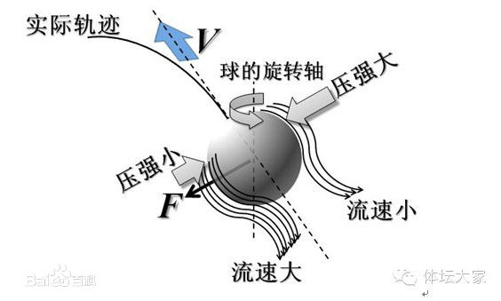

# 工程流体力学（甲）Ⅰ

!!! note "课程信息"
    - **主讲教师**：俞自涛、范利武
    - **教材**：孔珑主编《工程流体力学（第四版）》，中国电力出版社
    - **课程范围**：流体性质、流体静力学、理想流体动力学、黏性流动、可压缩一维流动、量纲分析与相似原理
    - **考核方式**：期末考试 60%；平时成绩 40%（作业、阅读和课堂测验）。此项按 2026 年秋季教学指南记录。

工程流体力学研究流体的静止、运动及其与固体之间的作用。管道阻力、泵与风机的功耗、喷管流量、机翼和球体受到的力，都可以沿着同一条思路分析：先选取流体模型，再写质量、动量和能量守恒关系，最后用材料性质与边界条件确定未知量。

本页按《工程流体力学（甲）Ⅰ》的六章教学提纲编排。回忆卷中出现的势流、边界层和激波问题放在相应章节或附录；文末把记忆不完整的题干标为“回忆题”，不补造缺失数据。

---

## 符号速查 { #fluid-symbol-quickref }

| 符号 | 含义 | 常用单位或关系 |
|------|------|----------------|
| $\rho$ | 密度 | $\mathrm{kg/m^3}$ |
| $p$ | 绝对压强 | $\mathrm{Pa}$ |
| $\mu$ | 动力黏度 | $\mathrm{Pa\cdot s}$ |
| $\nu$ | 运动黏度 | $\nu=\mu/\rho$，$\mathrm{m^2/s}$ |
| $\sigma$ | 表面张力系数 | $\mathrm{N/m}$ |
| $\boldsymbol V$、$u,v,w$ | 速度矢量及其直角坐标分量 | $\mathrm{m/s}$ |
| $Q$、$\dot m$ | 体积流量、质量流量 | $Q=AV$，$\dot m=\rho Q$ |
| $A,D,L$ | 截面积、管径、长度 | $\mathrm{m^2}$、$\mathrm m$ |
| $g$ | 重力加速度 | 约 $9.81\ \mathrm{m/s^2}$ |
| $\gamma_g$ | 气体比热比 | $\gamma_g=c_p/c_v$ |
| $\mathrm{Re}$ | 雷诺数 | $\rho VL/\mu=VL/\nu$ |
| $\mathrm{Ma}$ | 马赫数 | $V/a$ |
| $\boldsymbol\Omega$、$\boldsymbol\omega$ | 涡量、流体微团旋转角速度 | $\boldsymbol\Omega=\nabla\times\boldsymbol V=2\boldsymbol\omega$ |
| $\Gamma$ | 速度环量 | $\oint_C\boldsymbol V\cdot\mathrm d\boldsymbol l$ |
| $\delta,\delta^*,\theta$ | 边界层、位移、动量厚度 | $\mathrm m$ |
| $f_D,K$ | 达西沿程阻力系数、局部阻力系数 | 无量纲 |

!!! tip "同一个希腊字母可能有不同含义"
    有些教材用 $\gamma$ 表示流体重度 $\rho g$，也常用 $\gamma_g$ 表示气体比热比。本文用 $\rho g$ 表示重度，用 $\gamma_g$ 表示比热比；遇到原题时以题目定义为准。

---

## 章节概览

| 章节 | 标题 | 主要问题 |
|------|------|----------|
| 第一章 | 流体的性质 | 流体如何区别于固体，黏性和表面张力怎样进入模型 |
| 第二章 | 流体静力学 | 静止流体的压强如何分布，流体对平面和曲面施加多大作用力 |
| 第三章 | 理想流体动力学 | 连续性、欧拉方程和伯努利方程如何描述流动 |
| 第四章 | 黏性流体动力学 | 黏性流动、管道损失和边界层如何计算 |
| 第五章 | 可压缩流体一维定常流动 | 声速、马赫数、临界流动和喷管如何分析 |
| 第六章 | 量纲分析与相似原理 | 如何用少量无量纲参数组织实验和模型设计 |

!!! tip "建议的做题顺序"
    先明确流体是否可压缩、是否可忽略黏性、流动是否定常，再选择控制体或流体微团。写方程前先画出方向、截面和压强基准；算完后检查单位、符号和极限情形。

---

## 第一章 · 流体的性质

!!! info "章节概览"
    本章建立后续计算所用的流体模型。流体的核心特征是不能在静止平衡时承受剪切应力；运动时的黏性则把速度梯度和内摩擦联系起来。

### 流体与连续介质模型

流体包括液体和气体。与固体相比，流体没有固定形状；在切向力作用下会持续变形，直至应力消失或与其他作用达到平衡。固体在小变形范围内主要表现为“应力对应变”，牛顿流体则表现为“切应力对应变率”。

<figure markdown="span">
  { width="76%" }
  <figcaption>固体、液体和气体的微观排列示意。流体分子可相对移动，因此宏观上能持续变形（图源：流体基本概念课件）</figcaption>
</figure>

工程流体力学通常采用**连续介质假设**：把流体看成在空间中连续分布的介质，密度、压强、温度和速度等量都视为连续场。只要研究尺度远大于分子平均自由程，这个模型就能有效描述大多数常见工程流动。

液体通常较难压缩，在许多低速工程问题中可取 $\rho=\text{常数}$；气体容易压缩，密度可能随压强和温度明显变化。是否可视为不可压缩，最终应由工况决定，而不能仅凭“液体”或“气体”的名称判断。

### 密度、重度与压缩性

密度定义为单位体积内的质量：

$$
\rho=\frac{m}{V}
$$

重度为单位体积的重量，记作 $\rho g$。相对密度是流体密度与规定参考物质密度之比，无量纲。

描述压缩性的常用量是体积弹性模量：

$$
K=-V\left(\frac{\partial p}{\partial V}\right),\qquad
\beta=\frac{1}{K}
$$

$K$ 越大，流体越难压缩；$\beta$ 越小，压缩性越弱。水在一般低压流动中常可近似按不可压缩流体处理，气体则需结合流速、压差和温度变化判断。

### 黏性与牛顿内摩擦定律

**黏性**是流体抵抗相邻流层相对滑动的性质。黏性在运动中表现为内摩擦：速度不同的流层相互作用，较快流层受到阻滞，较慢流层受到拖曳。

对两块平行板之间的简单剪切流动，若速度主要沿 $x$ 方向变化、且沿法向 $y$ 的速度分布为 $u(y)$，牛顿内摩擦定律为

$$
\tau=\mu\frac{\mathrm du}{\mathrm dy}
$$

其中 $\tau$ 为切应力，$\mu$ 为动力黏度。动力黏度反映流体内摩擦的强弱，单位为 $\mathrm{Pa\cdot s}$。运动黏度定义为

$$
\nu=\frac{\mu}{\rho}
$$

单位为 $\mathrm{m^2/s}$。动力黏度用于应力关系；运动黏度常出现在雷诺数和扩散方程中。

<figure markdown="span">
  { width="82%" }
  <figcaption>黏性流体在板间受拖曳后形成速度梯度；黏性切应力与速度梯度成正比（图源：流体基本概念课件）</figcaption>
</figure>

牛顿流体的切应力与剪切速率成线性关系。水和空气在常见工程条件下可近似看作牛顿流体。剪切稀化、剪切增稠或具有屈服应力的流体属于非牛顿流体，不能直接套用常数 $\mu$ 的牛顿内摩擦定律。

!!! note "温度对黏度的影响"
    常压附近，液体温度升高时黏度通常下降；气体温度升高时黏度通常上升。低压范围内压强影响常较弱，高压时则可能不可忽略。

黏度可用毛细管流量法、落球法或旋转黏度计测量。落球法需满足球体周围流动接近斯托克斯区，并对容器壁和端部效应作修正；毛细管法则根据已知管径、长度、压差和流量反算黏度。

### 表面张力与毛细现象

液体表面分子受力不对称，使液面具有收缩趋势。表面张力系数 $\sigma$ 表示单位长度上的表面张力，满足

$$
F=\sigma l
$$

若是肥皂膜，薄膜有两个自由表面，总拉力为 $F=2\sigma l$。对半径为 $R$ 的液滴，液内外压强差为 $2\sigma/R$；肥皂泡有内外两个界面，压强差为 $4\sigma/R$。

接触角 $\theta$ 表征液体、气体和固体三相交界处的界面状态。圆形细管内的毛细高度近似为

$$
h=\frac{2\sigma\cos\theta}{\rho g r}
$$

其中 $r$ 是管内半径。$\theta<90^\circ$ 时液面上升，$\theta>90^\circ$ 时液面下降。

<figure markdown="span">
  { width="78%" }
  <figcaption>接触角由固、液、气三相界面的平衡决定（图源：流体基本概念课件）</figcaption>
</figure>

### 雷诺数与流动状态

雷诺数衡量惯性作用相对黏性作用的强弱：

$$
\mathrm{Re}=\frac{\rho V L}{\mu}=\frac{VL}{\nu}
$$

其中 $V$ 是代表速度，$L$ 是代表长度。雷诺数小，黏性影响相对突出；雷诺数大，惯性影响相对突出。管流常用管径作特征长度；平板边界层常用距前缘的距离 $x$。

!!! key-point "雷诺数必须和特征尺度一起写"
    $\mathrm{Re}_D=VD/\nu$ 与 $\mathrm{Re}_x=Vx/\nu$ 对应不同问题。计算时注明所用的速度、长度和黏度，不能只写一个没有下标的雷诺数。

### 第一章例题 · 平板剪切的应力与黏度

两平板间距为 $h$，上板以速度 $U$ 运动，下板静止，压强沿流向均匀变化。若流动可近似为纯库埃特流，则

$$
u(y)=\frac{U}{h}y,\qquad
\tau=\mu\frac{U}{h}
$$

若已测得板上的剪切力 $F$，板面积为 $A$，则 $\mu=Fh/(AU)$。若存在压强梯度，速度分布还会叠加抛物线项，见第四章泊肃叶流动。

---

## 第二章 · 流体静力学

!!! info "章节概览"
    静止流体没有剪切应力，任一点的应力只有各向相同的压强。重力场中的压强随深度线性增加；在加速容器内，则应使用相对容器的有效体积力。

### 静压强及其特征

流体静止时，任一点的压强与受压面的方向无关。压强总沿受压面法线作用。静止液体满足帕斯卡原理：外加压强的变化会传递到液体内部各处。

重力场中取 $z$ 轴竖直向上，静力平衡方程为

$$
\frac{\partial p}{\partial x}=0,\qquad
\frac{\partial p}{\partial y}=0,\qquad
\frac{\partial p}{\partial z}=-\rho g
$$

若液体密度近似不变，则任意点压强为

$$
p=p_0+\rho g h
$$

$h$ 是测点低于自由液面的深度，$p_0$ 是液面压强。开口容器中 $p_0$ 通常为大气压。绝对压强、表压和真空度的关系是

$$
p_{\mathrm{abs}}=p_{\mathrm{atm}}+p_{\mathrm{gauge}},
\qquad
p_{\mathrm{vac}}=p_{\mathrm{atm}}-p_{\mathrm{abs}}
$$

### 测压管与压强计

静水中同一连通液体的同一水平面上压强相等。使用 U 形管或多液柱压强计时，可从已知压强处出发沿管逐段走到目标点：

- 向下经过液柱，压强增加 $\rho g\Delta h$；
- 向上经过液柱，压强减少 $\rho g\Delta h$；
- 穿过不同液体界面时，压强连续，但密度要换成该段液体的密度。

!!! tip "压强计的符号检查"
    先画出各段液柱高度，再给每一段标清“向上”或“向下”。若最终测点比已知点低且处于同一静止液体中，压强差应为正；出现相反符号通常是高度方向写错。

### 平面上的静水总压力

平面面积为 $A$，形心位于自由液面下深度 $h_c$，且液面压强为 $p_0$。对表压积分得合力大小

$$
F=\int_A \rho g h\,\mathrm dA=\rho g h_c A
$$

总压力作用点称为压力中心。对与自由液面相交、倾角为 $\alpha$ 的平面，沿平面从液面量距离 $s$，形心位置为 $s_c$，形心轴惯性矩为 $I_G$，则

$$
s_{cp}=s_c+\frac{I_G}{s_c A}
$$

压力中心通常低于形心，因为压强随深度增加。若液面上方还存在均匀表压，需要把均匀压强产生的合力一并计入。

### 曲面上的静水总压力

曲面受力可拆成水平和竖直分量：

- 水平分量等于该曲面在竖直平面上的投影所受静水总压力；
- 竖直分量等于曲面上方或下方假想液柱的重量，具体方向由受压侧和曲面形状决定；
- 合力为两分量的矢量和。

### 浮力与加速容器

物体浸入静止液体后，受到向上的浮力

$$
F_B=\rho g V_{\mathrm{disp}}
$$

其中 $V_{\mathrm{disp}}$ 是排开液体的体积。浮力作用线通过排开液体的体积中心。

若容器相对惯性系以加速度 $\boldsymbol a_0$ 平移，在容器坐标系中加入惯性力后，静止液体满足

$$
\nabla p=\rho(\boldsymbol g-\boldsymbol a_0)
$$

自由液面垂直于有效体积力方向。竖直容器向上加速时，液体相对容器的有效重力变为 $g+a_0$，底部压强梯度变大；水平加速时，自由液面倾斜。

<figure markdown="span">
  { width="54%" }
  <figcaption>细长液柱也能在较深处产生较大静压强；静压强取决于深度和液体密度，而非容器中液体总量（图源：流体基本概念课件）</figcaption>
</figure>

### 第二章例题 · U 形管压强计的列式

若一侧连接压强为 $p_A$ 的容器，另一侧开口于大气，测压液体密度为 $\rho_m$，被测液体密度为 $\rho$，按液面高度从 A 点向开口端逐段走。每经过一段液体，就按“向下加、向上减”写一项 $\rho_i g\Delta h_i$，最后令到达开口端的压强等于 $p_{\mathrm{atm}}$。多液柱题不宜直接套单一高度公式。

---

## 第三章 · 理想流体动力学

!!! info "章节概览"
    理想流体是忽略黏性的模型。质量守恒给出连续性方程，牛顿第二定律给出欧拉方程，机械能沿流线守恒给出伯努利方程。三者描述的物理量不同，不能互相替代。

### 描述流体运动

流体质点的位置和速度随时间变化。速度场可写成 $\boldsymbol V(x,y,z,t)$。质点沿时间走过的轨迹称为**迹线**；某一时刻处处与速度相切的曲线称为**流线**；连续经过固定空间点的流体质点构成**脉线**。定常流动中三者重合。

随流体质点观察的物理量变化率称为物质导数：

$$
\frac{D}{Dt}=\frac{\partial}{\partial t}+\boldsymbol V\cdot\nabla
$$

例如质点加速度为

$$
\boldsymbol a=\frac{D\boldsymbol V}{Dt}
=\frac{\partial\boldsymbol V}{\partial t}
+(\boldsymbol V\cdot\nabla)\boldsymbol V
$$

定常流动中局部加速度为零，但流体仍可因空间速度变化而有对流加速度。

### 质量守恒与连续性方程

控制体内质量变化率加上流出质量净通量为零：

$$
\frac{\partial}{\partial t}\int_{CV}\rho\,\mathrm dV
+\oint_{CS}\rho\boldsymbol V\cdot\boldsymbol n\,\mathrm dA=0
$$

微分形式为

$$
\frac{\partial\rho}{\partial t}+\nabla\cdot(\rho\boldsymbol V)=0
$$

不可压缩流体满足

$$
\nabla\cdot\boldsymbol V=0
$$

一维定常管流常用

$$
\rho_1 A_1V_1=\rho_2 A_2V_2
$$

不可压缩时退化为 $A_1V_1=A_2V_2=Q$。

### 理想流体运动方程与动量守恒

忽略黏性应力后，作用于流体微团的表面力只剩压强。欧拉方程为

$$
\rho\frac{D\boldsymbol V}{Dt}
=\rho\boldsymbol f-\nabla p
$$

其中 $\boldsymbol f$ 是单位质量体积力，重力场中为 $\boldsymbol g$。对控制体，动量定理写成

$$
\sum\boldsymbol F
=\frac{\partial}{\partial t}\int_{CV}\rho\boldsymbol V\,\mathrm dV
+\oint_{CS}\rho\boldsymbol V(\boldsymbol V\cdot\boldsymbol n)\,\mathrm dA
$$

定常单入口、单出口时，右侧简化为 $\dot m(\boldsymbol V_2-\boldsymbol V_1)$。计算弯管、喷嘴和射流受力时，应把压强力、重力及支座反力按同一坐标方向列出。

### 伯努利方程

对不可压缩、定常、无黏流动，若体积力有势，在同一条流线上积分欧拉方程可得

$$
\frac{p}{\rho}+\frac{V^2}{2}+gz=C
$$

或按单位重量写成水头形式

$$
\frac{p}{\rho g}+\frac{V^2}{2g}+z=H
$$

三项分别是压强水头、速度水头和位置水头。

!!! definition "使用伯努利方程前的检查"
    1. 流动可视为定常。
    2. 流体密度近似不变，黏性损失可以忽略或另行补入。
    3. 选取的两点在同一条流线上；若流动无旋，常数才可扩展到不同流线。
    4. 两点间没有未计入的泵功、涡轮功或显著热能交换。

实际黏性管流的伯努利方程需加入水头损失，并按需要加入泵扬程和涡轮取能，见第四章。停滞点处速度降为零，停滞压强为 $p_0=p+\rho V^2/2$；该关系是皮托管测量速度的基础。

### 小孔出流、文丘里管与皮托管

大容器液面面积远大于小孔面积、两处均近似为大气压、液面速度可忽略时，由伯努利方程得到托里拆利公式

$$
V_{\mathrm{out}}=\sqrt{2gh}
$$

文丘里管在缩口处截面积减小、速度升高、静压降低。联立连续性方程和两断面间伯努利方程可由压差求流量。皮托管利用迎流停滞点与静压孔之间的压差测得动压：

$$
V=\sqrt{\frac{2(p_0-p)}{\rho}}
$$

实际仪器需用流量系数、压强孔布置和密度修正。

---

## 第四章 · 黏性流体动力学

!!! info "章节概览"
    实际流体的黏性使壁面产生切应力和能量损失。本章的核心流程是先判断流动状态，再求速度分布或阻力系数，最后把沿程损失和局部损失并入能量方程。

### 广义牛顿内摩擦定律

在牛顿流体中，黏性应力与变形率成线性关系。常用的三个构成假设是：流体宏观上各向同性；黏性应力对变形率为线性响应；静止时切应力为零，法向应力退化为静压强。**不可压缩不是这三个假设之一**。

对不可压缩、黏度为常数的牛顿流体，偏应力张量为

$$
\boldsymbol\tau
=\mu\left[\nabla\boldsymbol V+(\nabla\boldsymbol V)^{\mathsf T}\right]
$$

平面剪切流中 $\tau_{xy}=\mu(\partial u/\partial y+\partial v/\partial x)$；若 $v=0$ 且 $u=u(y)$，就得到第一章的 $\tau_{xy}=\mu\,\mathrm du/\mathrm dy$。

对可压缩牛顿流体还需描述体积变形引起的各向同性黏性应力。常见的斯托克斯假设 $\lambda+2\mu/3=0$ 是对体黏度系数的闭合近似，不能与“流体不可压缩”混为一谈。

### 纳维－斯托克斯方程

对不可压缩、密度和黏度为常数的牛顿流体，纳维－斯托克斯方程的矢量形式为

$$
\frac{\partial\boldsymbol V}{\partial t}
+(\boldsymbol V\cdot\nabla)\boldsymbol V
=\boldsymbol f-\frac{1}{\rho}\nabla p+\nu\nabla^2\boldsymbol V
$$

左边是单位质量流体的局部和对流加速度；右边分别是体积力、压强力和黏性扩散项。求具体流动时还必须给出初始条件、固壁无滑移条件、入口出口条件或远场条件。

!!! note "固壁边界条件"
    黏性流体在固定固壁上通常满足无滑移、无穿透条件：壁面法向和切向速度都等于壁面速度。理想流体模型通常只强制无穿透，不要求切向速度与壁面相同。

### 库埃特流与泊肃叶流

两块平行板间距为 $h$，下板静止、上板以 $U$ 运动，且没有流向压强梯度时，库埃特流速度分布为

$$
u(y)=\frac{U}{h}y,\qquad
\tau_w=\mu\frac{U}{h},\qquad
Q'=\frac{Uh}{2}
$$

$Q'$ 是单位宽度的体积流量。

两板固定、压强沿 $x$ 方向下降时，板间平面泊肃叶流为

$$
u(y)=-\frac{1}{2\mu}\frac{\mathrm dp}{\mathrm dx}y(h-y)
$$

最大速度在中面，平均速度为最大速度的 $2/3$：

$$
u_{\max}=-\frac{h^2}{8\mu}\frac{\mathrm dp}{\mathrm dx},
\qquad
\bar u=\frac{2}{3}u_{\max},
\qquad
Q'=-\frac{h^3}{12\mu}\frac{\mathrm dp}{\mathrm dx}
$$

圆管内充分发展层流的速度剖面为抛物线：

$$
u(r)=-\frac{1}{4\mu}\frac{\mathrm dp}{\mathrm dx}(R^2-r^2)
$$

相应流量和平均速度为

$$
Q=\frac{\pi R^4}{8\mu}\frac{\Delta p}{L},
\qquad
\bar u=\frac{R^2\Delta p}{8\mu L}
$$

### 例题：圆盘在窄缝中转动的黏性阻力矩

半径为 $R=d/2$ 的圆盘以角速度 $\omega$ 转动，盘面与静止壁面之间有均匀、很薄的流体缝隙 $\delta$，动力黏度为 $\mu$。求流体作用在**圆盘这一侧表面**上的阻力矩大小。设 $\delta\ll d$，忽略圆盘边缘效应，并把缝隙中的速度分布近似看成直线。

**第一步：先看半径 $r$ 处，不要把整张圆盘当成同一个速度。**该处盘面切向速度是 $v_0=\omega r$，静止壁面速度为零。由无滑移条件和线性速度分布，缝隙内速度梯度及盘面切应力为

$$
\frac{\mathrm dv}{\mathrm dz}\approx\frac{\omega r}{\delta},
\qquad
\tau(r)=\mu\frac{\omega r}{\delta}.
$$

**第二步：取一个很窄的圆环。**半径为 $r$、宽为 $\mathrm dr$ 的环带面积是 $\mathrm dA=2\pi r\,\mathrm dr$。环带上的摩擦力，再乘以力臂 $r$，才得到微元力矩：

$$
\mathrm dF=\tau(r)\,\mathrm dA
=\frac{2\pi\mu\omega}{\delta}r^2\,\mathrm dr,
\qquad
\mathrm dM=r\,\mathrm dF
=\frac{2\pi\mu\omega}{\delta}r^3\,\mathrm dr.
$$

**第三步：沿半径积分。**圆心处 $r=0$，盘缘处 $r=d/2$，因此阻力矩大小为

$$
M=\int_0^{d/2}\frac{2\pi\mu\omega}{\delta}r^3\,\mathrm dr
=\frac{\pi\mu\omega d^4}{32\delta}
=\frac{\pi\mu\omega R^4}{2\delta}.
$$

!!! tip "为什么积分里是 $r^3$？"
    $\tau\propto r$（盘缘速度更快），$\mathrm dA\propto r\,\mathrm dr$（外圈环带更长），力臂又是 $r$。三者相乘得到 $r^3\,\mathrm dr$。切应力随半径变化，不能直接用一整个圆盘面积乘一个固定切应力。

若转速以每分钟 $n$ 转给出，代入 $\omega=2\pi n/60=\pi n/30$ 即可。上式只计**一个盘面与一处缝隙**；若上下两侧条件完全相同，两个盘面的阻力矩相加。量纲检查：$[\mu\omega d^4/\delta]=\mathrm{N\cdot m}$。

### 例题：同心圆柱窄环隙中的旋转阻力

半径为 $d/2$、长度为 $L$ 的圆柱轴在静止圆筒中转动，均匀环隙宽度为 $\delta$，其中充满动力黏度为 $\mu$ 的流体。若 $\delta\ll d$，忽略端面和轴承损失，求流体对转轴的阻力矩及维持转动所需功率。

轴面半径为 $d/2$，所以轴面切向速度为 $v_0=\omega d/2$；外筒静止，窄环隙内可近似为线性速度分布。轴面切应力与润湿面积分别为

$$
\tau=\mu\frac{v_0}{\delta}
=\frac{\mu\omega d}{2\delta},
\qquad
A=\pi dL.
$$

把切应力乘以轴面面积得到切向阻力，再乘轴半径得到阻力矩：

$$
F=\tau A=\frac{\pi\mu Ld^2\omega}{2\delta},
\qquad
M=F\frac d2=\frac{\pi\mu Ld^3\omega}{4\delta}.
$$

维持匀速转动时，驱动功率等于阻力矩乘角速度：

$$
P=M\omega=\frac{\pi\mu Ld^3\omega^2}{4\delta}.
$$

!!! tip "圆柱与圆盘的积分区别"
    圆柱轴面上半径固定为 $d/2$，因此切应力处处相同，直接用 $M=F(d/2)$。圆盘上半径从 $0$ 变到 $d/2$，局部速度和力臂都随半径变化，必须对环带积分。

### 例题：往复活塞克服黏性摩擦的平均功率

活塞长 $L=10\ \mathrm{cm}$、直径 $d=8\ \mathrm{cm}$，在同心圆筒中往复运动。均匀间隙为 $\delta=0.5\ \mathrm{mm}$，油液动力黏度为 $\mu=0.09\ \mathrm{Pa\cdot s}$。活塞位移为 $x=a\sin(\omega t)$，振幅 $a=20\ \mathrm{cm}$，每分钟往复 $n=360$ 次。忽略活塞惯性及端面摩擦，求克服流体摩擦所需的平均功率。

**先由位移求速度。**一往复对应一个周期，角频率为

$$
\omega=\frac{2\pi n}{60}=12\pi\ \mathrm{rad/s},
\qquad
v(t)=\frac{\mathrm dx}{\mathrm dt}=a\omega\cos(\omega t).
$$

活塞侧面与静止圆筒之间近似为库埃特流，润湿侧面积 $A=\pi dL$，故切应力大小和摩擦力大小为

$$
\tau(t)=\mu\frac{|v(t)|}{\delta},
\qquad
F(t)=\tau(t)A=\frac{\pi\mu Ld}{\delta}|v(t)|.
$$

瞬时驱动功率等于摩擦力乘活塞速度大小，即 $P(t)=F(t)|v(t)|$。由于 $v^2(t)=a^2\omega^2\cos^2(\omega t)$，而一个周期内 $\cos^2$ 的平均值为 $1/2$，得到

$$
\bar P=\frac{\pi\mu Ld}{\delta}\,\overline{v^2}
=\frac{\pi\mu Ld\,a^2\omega^2}{2\delta}
\approx129\ \mathrm W.
$$

代入 SI 单位：$L=0.10\ \mathrm m$、$d=0.08\ \mathrm m$、$a=0.20\ \mathrm m$、$\delta=5.0\times10^{-4}\ \mathrm m$。这里求的是一个完整往复周期的平均功率；不能把最大速度代入后当作平均值。

### 管流状态与沿程阻力

圆管雷诺数为 $\mathrm{Re}_D=\bar uD/\nu$。通常 $\mathrm{Re}_D\lesssim2300$ 为层流，约 $2300$ 至 $4000$ 为过渡区，较大时为湍流；临界值会受入口扰动、管道粗糙度等影响。

达西－魏斯巴赫公式写作

$$
h_f=f_D\frac{L}{D}\frac{\bar u^2}{2g}
$$

层流时 $f_D=64/\mathrm{Re}_D$。湍流时 $f_D$ 取决于雷诺数和相对粗糙度 $\epsilon/D$，可用莫迪图或科尔布鲁克公式求取：

$$
\frac{1}{\sqrt{f_D}}
=-2\log_{10}\left(
\frac{\epsilon}{3.7D}+\frac{2.51}{\mathrm{Re}_D\sqrt{f_D}}
\right)
$$

水力光滑管、过渡粗糙管和完全粗糙管对应不同的黏性与粗糙度影响区间，不能仅凭“粗糙”或“光滑”口头判断系数。

局部阻力按

$$
h_m=K\frac{V_{\mathrm{ref}}^2}{2g}
$$

计算，$K$ 对应的参考速度必须与阻力系数定义一致。突扩、突缩、弯头、阀门和入口出口都可能产生局部损失。

### 管路能量方程与组合管路

实际流动沿程的能量方程可写为

$$
\frac{p_1}{\rho g}+\alpha_1\frac{V_1^2}{2g}+z_1+H_p
=
\frac{p_2}{\rho g}+\alpha_2\frac{V_2^2}{2g}+z_2+H_t+h_L
$$

$H_p$ 为泵对流体增加的水头，$H_t$ 为涡轮从流体取走的水头，$h_L$ 是沿程和局部损失之和，$\alpha$ 是动能修正系数。

串联管路各段流量相同，总损失为各段损失之和；并联支路的总水头损失相同，总流量等于各支路流量之和。复杂管网可按节点连续方程与回路能量方程联立求解。

### 边界层、厚度与分离

高雷诺数外部流动中，黏性影响常集中在固壁附近的薄层内，称为边界层。边界层内速度由壁面速度逐渐趋向外缘速度 $U$；常把速度达到 $0.99U$ 的位置定义为厚度 $\delta$。

位移厚度反映边界层造成的质量流量亏损：

$$
\delta^*=\int_0^\infty\left(1-\frac{u}{U}\right)\mathrm dy
$$

它表示外部无黏流若整体向外位移多少，才能补偿边界层带来的质量流量减少。动量厚度反映动量亏损：

$$
\theta=\int_0^\infty\frac{u}{U}\left(1-\frac{u}{U}\right)\mathrm dy
$$

当 $0\leq u/U\leq1$ 时，通常满足

$$
0<\theta<\delta^*<\delta
$$

因此位移厚度小于边界层厚度、大于动量厚度。

零压强梯度平板层流边界层的布拉修斯近似结果为

$$
\delta\approx\frac{5x}{\sqrt{\mathrm{Re}_x}},\qquad
\delta^*\approx\frac{1.721x}{\sqrt{\mathrm{Re}_x}},\qquad
\theta\approx\frac{0.664x}{\sqrt{\mathrm{Re}_x}}
$$

$$
\tau_w\approx\frac{0.332\rho U^2}{\sqrt{\mathrm{Re}_x}},
\qquad
c_{f,x}=\frac{\tau_w}{\tfrac12\rho U^2}
\approx\frac{0.664}{\sqrt{\mathrm{Re}_x}}
$$

平板从前缘到 $L$ 的平均摩擦系数为 $\bar c_f\approx1.328/\sqrt{\mathrm{Re}_L}$。湍流边界层在相同雷诺数、相同平板和常见光滑平板比较条件下通常有更大的摩擦阻力；它近壁动量交换强，也更能抵抗逆压强梯度。层流和湍流边界层都可能发生分离，判据是壁面切应力降到零并出现反向流动，不能说“层流不会分离”。

冯卡门动量积分方程的一般形式为

$$
\frac{\tau_w}{\rho}
=U^2\frac{\mathrm d\theta}{\mathrm dx}
+U\frac{\mathrm dU}{\mathrm dx}(2\theta+\delta^*)
$$

若外流速度 $U$ 为常数，方程简化为 $\tau_w=\rho U^2\,\mathrm d\theta/\mathrm dx$。给出速度剖面 $u/U=f(y/\delta)$ 时，依次计算 $\theta/\delta$、壁面速度梯度，再代入动量积分方程求 $\delta(x)$；摩擦阻力要对壁面切应力沿长度积分。

### 第四章例题 · 用示范剖面求边界层厚度与摩擦

!!! note "演示题，非回忆卷原式"
    回忆题的速度剖面系数和幂次不完整。以下取一个近似剖面演示动量积分法；考试时应改用题面给定的剖面重新积分。

设零压强梯度平板流动满足

$$
\frac{u}{U}=2\eta-\eta^2,\qquad \eta=\frac{y}{\delta}
$$

该剖面满足壁面无滑移、外缘速度为 $U$ 且外缘速度梯度为零。积分得

$$
\delta^*=\frac{\delta}{3},\qquad
\theta=\frac{2\delta}{15}
$$

壁面切应力为

$$
\tau_w=\mu\left.\frac{\partial u}{\partial y}\right|_{y=0}
=\frac{2\mu U}{\delta}
$$

代入动量积分方程并令 $\nu=\mu/\rho$：

$$
\frac{2}{15}\frac{\mathrm d\delta}{\mathrm dx}
=\frac{2\nu}{U\delta}
\quad\Longrightarrow\quad
\delta(x)=\sqrt{\frac{30\nu x}{U}}
$$

若取 $\nu=10^{-6}\ \mathrm{m^2/s}$、$U=1\ \mathrm{m/s}$、$L=1\ \mathrm m$、$\rho=1000\ \mathrm{kg/m^3}$，则 $\mathrm{Re}_L=10^6$，$\delta(L)\approx5.48\ \mathrm{mm}$，$\tau_w(L)\approx0.365\ \mathrm{Pa}$。宽 $b=0.5\ \mathrm m$ 的平板两面总摩擦阻力为

$$
F_{\text{双面}}=2b\int_0^L\tau_w\,\mathrm dx
=4bL\tau_w(L)\approx0.730\ \mathrm N
$$

相应的平均摩擦系数为 $\bar c_f=8/\sqrt{30\mathrm{Re}_L}\approx1.46\times10^{-3}$。

---

## 第五章 · 可压缩流体一维定常流动

!!! info "章节概览"
    本章主要研究密度随压强、温度变化的高速气流。先由声速确定马赫数，再结合连续方程、能量方程和等熵关系分析喷管截面变化和流量是否堵塞。

### 声速、马赫数与等熵关系

小扰动在气体中传播的速度称为声速。对热完全气体的等熵小扰动，

$$
a=\sqrt{\left(\frac{\partial p}{\partial\rho}\right)_s}
=\sqrt{\gamma_gRT}
$$

马赫数为

$$
\mathrm{Ma}=\frac{V}{a}
$$

$\mathrm{Ma}<1$ 为亚声速，$\mathrm{Ma}=1$ 为声速，$\mathrm{Ma}>1$ 为超声速。若气流变化足够缓慢且过程可逆、绝热，满足

$$
\frac{p}{\rho^{\gamma_g}}=\text{常数},\qquad
\frac{T_2}{T_1}=\left(\frac{p_2}{p_1}\right)^{(\gamma_g-1)/\gamma_g}
$$

### 定常一维能量方程与滞止参数

稳定、绝热、无轴功的一维流动满足

$$
h+\frac{V^2}{2}=h_0
$$

对定比热理想气体，

$$
T_0=T+\frac{V^2}{2c_p}
=T\left(1+\frac{\gamma_g-1}{2}\mathrm{Ma}^2\right)
$$

$T_0$ 是气流等熵减速到零速时的滞止温度。等熵流动中滞止温度和滞止压强不变。滞止压强关系为

$$
\frac{p_0}{p}
=\left(1+\frac{\gamma_g-1}{2}\mathrm{Ma}^2\right)^{\gamma_g/(\gamma_g-1)}
$$

### 等熵喷管与临界流动

一维定常质量守恒为

$$
\dot m=\rho AV=\text{常数}
$$

气流速度、密度和截面积的变化满足

$$
\frac{\mathrm dA}{A}=(\mathrm{Ma}^2-1)\frac{\mathrm dV}{V}
$$

亚声速流动要加速，需要收缩截面；超声速流动要加速，需要扩张截面。收缩－扩张喷管可先在收缩段加速到声速，再在扩张段继续加速到超声速。

当喉部达到 $\mathrm{Ma}=1$，质量流率达到给定滞止状态下的最大值，称为**临界或堵塞流动**。临界状态参数为

$$
\frac{T^*}{T_0}=\frac{2}{\gamma_g+1},\qquad
\frac{p^*}{p_0}
=\left(\frac{2}{\gamma_g+1}\right)^{\gamma_g/(\gamma_g-1)}
$$

继续降低背压不会再增加喉部质量流率；喷管下游的压力调整可能通过膨胀波、压缩波或激波完成。

### 第五章例题 · 判断收缩段是否能使气流加速

先算入口马赫数 $\mathrm{Ma}_1=V_1/\sqrt{\gamma_gRT_1}$。若入口为亚声速，缩小面积使速度增大、静压和静温下降；若已是超声速，单纯收缩反而使速度降低。若题目要求出口超声速，应确认装置是否包含达到声速的喉部和其后的扩张段。

---

## 第六章 · 量纲分析与相似原理

!!! info "章节概览"
    实验研究往往同时涉及几何尺寸、流速、密度、黏度和重力等变量。量纲分析把变量组合成无量纲数，帮助减少实验次数，并判断模型与原型能否相似。

### 量纲一致性与 $\Pi$ 定理

量纲一致性要求物理方程两边的量纲相同。对 $n$ 个物理量，如果它们由 $k$ 个独立基本量纲组成，依巴金汉 $\Pi$ 定理指出问题可化为 $n-k$ 个独立无量纲组合之间的关系。

常见基本量纲为质量 $M$、长度 $L$、时间 $T$ 和温度 $\Theta$。选重复变量时，应满足：彼此量纲独立、涵盖问题所含基本量纲，且不把待求因变量选作重复变量。

### 量纲分析步骤

1. 写出待求量及所有可能相关变量。
2. 列出各变量的量纲。
3. 选出满足独立性条件的重复变量。
4. 对每个非重复变量构造无量纲乘积，解出指数。
5. 检查各 $\Pi$ 群的量纲确为 1，再由实验确定群间函数关系。

### 相似条件与常见无量纲数

模型与原型通常依次检查几何相似、运动相似和动力相似。对主导物理机制，需使对应无量纲数相等或足够接近：

| 无量纲数 | 定义 | 主要比较的作用 |
|-----------|------|----------------|
| 雷诺数 $\mathrm{Re}$ | $\rho VL/\mu$ | 惯性力与黏性力 |
| 弗劳德数 $\mathrm{Fr}$ | $V/\sqrt{gL}$ | 惯性力与重力 |
| 欧拉数 $\mathrm{Eu}$ | $\Delta p/(\rho V^2)$ | 压强力与惯性力 |
| 马赫数 $\mathrm{Ma}$ | $V/a$ | 流速与声速，衡量压缩性 |
| 韦伯数 $\mathrm{We}$ | $\rho V^2L/\sigma$ | 惯性力与表面张力 |

管流阻力实验通常优先匹配雷诺数；自由液面波浪常需匹配弗劳德数；高速气流需关注马赫数；小尺度液滴和毛细流动需关注韦伯数。若多个效应都不可忽略，模型尺度设计可能无法同时满足所有相似条件，应说明主要误差来自哪一项。

### 第六章例题 · 圆柱阻力的无量纲表达

设圆柱受到的阻力 $F_D$ 与流体密度 $\rho$、动力黏度 $\mu$、来流速度 $V$ 和圆柱直径 $D$ 有关。取 $\rho,V,D$ 为重复变量，可得

$$
\frac{F_D}{\rho V^2D^2}
=\Phi\left(\frac{\rho VD}{\mu}\right)
$$

左侧可整理为阻力系数，右侧是雷诺数的函数。于是不同尺寸模型在相同雷诺数下，阻力系数可直接比较。

---

## 附录一 · 正激波计算

激波是有限厚度内发生的强压缩波。跨越激波时黏性和热传导不可忽略，熵增加，过程不可逆，因此不能把前后状态直接按等熵关系联系。对绝热正激波，质量、动量和能量守恒分别为

$$
\rho_1V_1=\rho_2V_2
$$

$$
p_1+\rho_1V_1^2=p_2+\rho_2V_2^2
$$

$$
h_1+\frac{V_1^2}{2}=h_2+\frac{V_2^2}{2}
$$

对热完全气体，常用结果为

$$
\frac{p_2}{p_1}
=1+\frac{2\gamma_g}{\gamma_g+1}(\mathrm{Ma}_1^2-1)
$$

$$
\frac{\rho_2}{\rho_1}
=\frac{(\gamma_g+1)\mathrm{Ma}_1^2}
{2+(\gamma_g-1)\mathrm{Ma}_1^2}
$$

$$
\frac{T_2}{T_1}
=\frac{p_2/p_1}{\rho_2/\rho_1}
$$

$$
\mathrm{Ma}_2^2
=\frac{1+\tfrac{\gamma_g-1}{2}\mathrm{Ma}_1^2}
{\gamma_g\mathrm{Ma}_1^2-\tfrac{\gamma_g-1}{2}}
$$

对压缩正激波，$\mathrm{Ma}_1>1$，$\mathrm{Ma}_2<1$；静压、密度、温度升高，速度降低，滞止温度保持不变而滞止压强降低。

### 正激波例题 · $\mathrm{Ma}_1=2.5$

空气取 $\gamma_g=1.4$，上游静温 $T_1=300\ \mathrm K$，上游静压 $p_1=100\ \mathrm{kPa}$。代入关系式得

$$
\frac{p_2}{p_1}=7.125,\qquad
\frac{\rho_2}{\rho_1}=3.333,\qquad
T_2=641.25\ \mathrm K,\qquad
\mathrm{Ma}_2\approx0.513
$$

因此 $p_2=712.5\ \mathrm{kPa}$。若题目只问压强比、下游温度和下游马赫数，$p_1$ 不影响后两者。

### 正激波例题 · 上游空气静止、激波速度为 $500\ \mathrm{m/s}$

若 $500\ \mathrm{m/s}$ 表示激波相对实验室的速度，而上游空气在实验室中静止，则激波固定坐标系中的上游速度大小为 $V_1=500\ \mathrm{m/s}$。取 $T_1=25^\circ\mathrm C=298.15\ \mathrm K$、$p_1=1.01\times10^5\ \mathrm{Pa}$、$R=287\ \mathrm{J/(kg\cdot K)}$、$\gamma_g=1.4$：

$$
a_1=\sqrt{\gamma_gRT_1}\approx346.12\ \mathrm{m/s},
\qquad
\mathrm{Ma}_1\approx1.445
$$

计算得

$$
\frac{p_2}{p_1}\approx2.268,\quad
\frac{\rho_2}{\rho_1}\approx1.767,\quad
T_2\approx382.7\ \mathrm K,\quad
\mathrm{Ma}_2\approx0.722
$$

激波固定坐标系中的下游速度大小为

$$
V_2=V_1\frac{\rho_1}{\rho_2}\approx283.0\ \mathrm{m/s}
$$

若题目问实验室坐标系中的下游空气速度，且激波向静止空气方向前进，则下游空气速度约为 $500-283=217\ \mathrm{m/s}$。答题时必须先辨清参考系。

## 附录二 · 回忆卷考点与解题

!!! note "回忆题的使用范围"
    以下内容依据用户提供的多学期回忆整理。题目版本、课程归属或原始数值记忆不完整处会明确标注，只给通用判定方法，不把推测补成原题。

### 选择题与判断题速查

| 题目要点 | 结论 | 判断依据 |
|----------|------|----------|
| 涡线切线方向 | 涡量矢量方向 | 涡线定义为处处与 $\boldsymbol\Omega$ 相切 |
| 无旋流动 | $\nabla\times\boldsymbol V=0$ | 无旋不代表流体静止 |
| 正压流体 | $\rho=\rho(p)$ | 压强梯度与密度梯度平行 |
| 小扰动且忽略黏性耗散 | 等熵近似 | 绝热且可逆的小扰动，不是等焓过程 |
| 广义牛顿内摩擦定律的假设 | “流体不可压缩”不是三项假设之一 | 线性、各向同性、静止时退化为静压应力 |
| 速度势与流函数 | 柯西－黎曼条件 | 两者同时存在时满足导数关系 |
| 位移厚度的物理意义 | 质量流量亏损对应的外流位移 | 动量亏损对应动量厚度 |
| 非牛顿流体 | 不满足常数黏度的线性应力－变形率关系 | 不能直接套牛顿内摩擦定律 |
| 正激波前后马赫数 | $\mathrm{Ma}_1>1,\ \mathrm{Ma}_2<1$ | 正激波将超声速流减速到亚声速 |
| 斯托克斯定理 | 速度环量等于涡量通量 | $\oint_C\boldsymbol V\cdot\mathrm d\boldsymbol l=\int_S(\nabla\times\boldsymbol V)\cdot\boldsymbol n\,\mathrm dA$ |
| 涡管截面减小 | 涡量和旋转角速度增大 | 涡管强度近似为 $\Omega A$ 并守恒 |
| 位移厚度、动量厚度、边界层厚度 | $\theta<\delta^*<\delta$ | 适用于速度从零单调趋近外流速度的常见边界层 |
| 层流边界层不会分离 | 错 | 层流也能在逆压强梯度下分离；湍流只是通常更抗分离 |
| 同一平板、同一雷诺数下层流和湍流摩擦 | 常见全湍流比较中湍流摩擦较大 | 湍流近壁动量交换强；须确认处于湍流关联式适用区间 |
| 平面不可压缩势流的 $\phi,\psi$ | 两者都满足拉普拉斯方程 | 需要同时满足不可压缩和无旋条件 |
| 开尔文环量定理 | 定常不是必要条件 | 常用条件是无黏、正压和有势体积力 |
| 圆柱有环量绕流的组成 | 均匀来流、满足圆柱表面不穿透条件的偶极流、点涡 | 方向取决于坐标和环量正号约定 |
| 有环量圆柱绕流的升力 | $L'=\rho U_\infty\lvert\Gamma\rvert$ | 单位展长升力与半径无直接关系 |

!!! note "“声速小扰动为等熵”的前提"
    声波可近似看作小振幅、快速、绝热且可逆的扰动，所以使用等熵声速关系。若存在强耗散、热交换或激波，不能把过程当成等熵。

### 证明题 · 连续性与有势性

若给出二维速度分量 $u(x,y)$、$v(x,y)$，可按下列顺序作答：

1. 检查不可压缩连续性：$\partial u/\partial x+\partial v/\partial y=0$。
2. 检查无旋性：$\omega_z=\tfrac12(\partial v/\partial x-\partial u/\partial y)=0$，等价地检查二维旋度为零。
3. 若无旋且区域单连通，积分 $u=\phi_x,\ v=\phi_y$ 求速度势；若不可压缩，积分 $u=\psi_y,\ v=-\psi_x$ 求流函数。
4. 最后对求出的 $\phi,\psi$ 求偏导，验证是否还原原速度场。

为演示步骤，自拟一个速度场（不代表回忆卷原题）：

$$
u=2x,\qquad v=-2y
$$

其散度为 $2-2=0$，涡量为 $\omega_z=\tfrac12(0-0)=0$，所以流动不可压缩且无旋。积分得到

$$
\phi=x^2-y^2+C
$$

$$
\psi=2xy+C
$$

### 证明题 · 圆周速度环量

以 $u=-ay,\ v=ax$ 表示绕 $z$ 轴的平面刚体旋转。对半径 $R$ 的圆周取

$$
x=R\cos\theta,\qquad y=R\sin\theta,\qquad
\mathrm dx=-R\sin\theta\,\mathrm d\theta,\qquad
\mathrm dy=R\cos\theta\,\mathrm d\theta
$$

于是

$$
\Gamma=\oint_C(u\,\mathrm dx+v\,\mathrm dy)
=\int_0^{2\pi}aR^2\,\mathrm d\theta
=2\pi aR^2
$$

回忆中另有 $3\pi aR^2$ 的版本，且速度矢量分量和根号项不完整。系数取决于原速度场；应按题面参数重新代入线积分，不能只凭记忆把 $2\pi$ 改成 $3\pi$。

### 计算题 · 用边界层速度剖面求摩擦阻力

先从题目给定剖面 $f(\eta)=u/U$ 计算

$$
\frac{\theta}{\delta}
=\int_0^1f(\eta)[1-f(\eta)]\,\mathrm d\eta,\qquad
\tau_w=\frac{\mu U}{\delta}f'(0)
$$

零压强梯度时，代入 $\tau_w=\rho U^2\,\mathrm d\theta/\mathrm dx$，解出 $\delta(x)$。之后将 $\tau_w(x)$ 沿板长积分；若问双面阻力，还要乘以 2。

!!! warning "不同版本的边界层剖面不要混成同一道题"
    用户转述的回忆版本中，速度剖面可能为 $3\eta-2\eta^2$，但系数和幂次记忆不完整。做题时应以试卷给定的剖面重新积分，不要沿用未核实的积分系数。

### 简答题 · 足球弧线与月球环境

足球自转使球两侧边界层速度分布不同，球面周围压强因此不对称，形成垂直于来流和自转轴的马格努斯力，轨迹随之弯曲。月球表面近似真空，空气动力极弱，普通踢球条件下不会出现可见香蕉球；如果提供足够密度的气体，马格努斯效应仍会发生。

<figure markdown="span">
  { width="62%" }
  <figcaption>球体自转改变两侧近壁流动，形成压力差和横向力（图源：流体基本概念课件）</figcaption>
</figure>

---

## 复习时最容易混淆的几组关系

- **静压强与伯努利压强**：静水公式由静力平衡得到；伯努利方程沿流线连接压强、速度和高度。
- **黏度与运动黏度**：$\mu$ 进入应力关系，$\nu=\mu/\rho$ 进入雷诺数。
- **环量与涡量**：环量是沿闭合线的速度积分；涡量是速度旋度，二者通过斯托克斯定理联系。
- **流线与迹线**：定常时重合；非定常时通常不同。
- **位移厚度与动量厚度**：质量流量亏损用 $\delta^*$，动量亏损用 $\theta$。
- **总压与静压**：总压用于等熵减速至停滞状态；跨越激波时总压下降。
- **达西系数与局部系数**：沿程项还要乘 $L/D$；局部损失项使用题目指定的参考速度。
- **伯努利方程与动量方程**：前者平衡机械能，后者平衡矢量动量；弯管受力题通常两者都要用。

---

## 资料说明

主体章节依照《工程流体力学（甲）Ⅰ的课程知识体系》《课程教学指南_2026年秋季学期》及对应课程资料整理；黏性流动、可压缩流动和量纲分析按教学提纲补齐。回忆题解析仅依据用户提供的题目线索整理，课件原图保留并注明来源。
