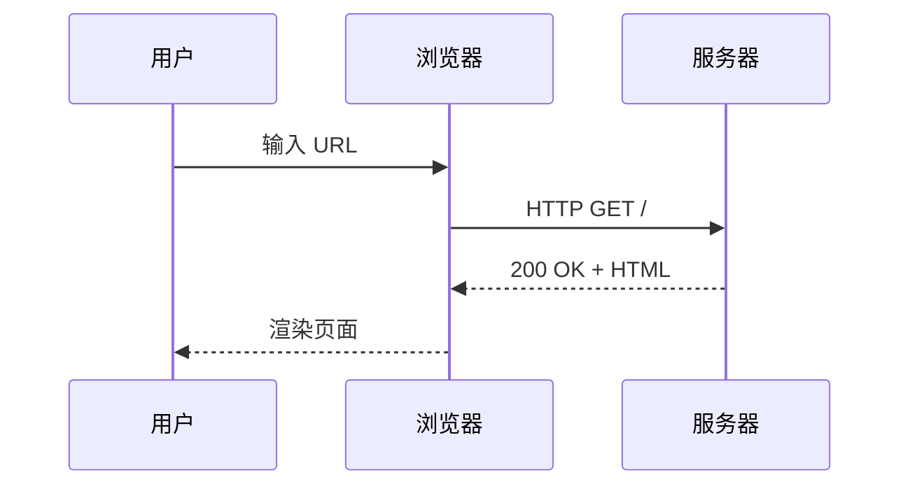

# 示例笔记

这是一篇演示 MkDocs + Material 主题各种功能的示例笔记。

---

## 文本格式

普通文本，**加粗**，*斜体*，~~删除线~~，`行内代码`，==高亮==，^上标^，~下标~

键盘按键：++ctrl+c++ 复制，++ctrl+v++ 粘贴

---

## 提示框

!!! note "笔记"
    这是一条笔记。

!!! tip "技巧"
    这是一个实用技巧。

!!! warning "警告"
    注意事项写在这里。

!!! danger "危险"
    重要警告。

!!! success "成功"
    操作成功的提示。

!!! info "信息"
    背景信息。

??? example "可折叠示例（点击展开）"
    这里是折叠的内容，点击标题可以展开/收起。

---

## 代码块

=== "Python"

    ```python linenums="1" hl_lines="3 4"
    def fibonacci(n: int) -> list[int]:
        """生成斐波那契数列"""
        result = [0, 1]  # (1)!
        for i in range(2, n):  # (2)!
            result.append(result[-1] + result[-2])
        return result[:n]
    ```

    1. 初始化前两项
    2. 从第三项开始迭代

=== "JavaScript"

    ```javascript linenums="1"
    function fibonacci(n) {
      const result = [0, 1];
      for (let i = 2; i < n; i++) {
        result.push(result[i - 1] + result[i - 2]);
      }
      return result.slice(0, n);
    }
    ```

=== "Rust"

    ```rust linenums="1"
    fn fibonacci(n: usize) -> Vec<u64> {
        let mut result = vec![0, 1];
        for i in 2..n {
            let next = result[i - 1] + result[i - 2];
            result.push(next);
        }
        result.truncate(n);
        result
    }
    ```

---

## 数学公式

行内公式：勾股定理 $a^2 + b^2 = c^2$

块级公式：

$$
\sum_{n=1}^{\infty} \frac{1}{n^2} = \frac{\pi^2}{6}
$$

$$
\begin{pmatrix}
a & b \\
c & d
\end{pmatrix}
\begin{pmatrix}
x \\ y
\end{pmatrix}
=
\begin{pmatrix}
ax + by \\ cx + dy
\end{pmatrix}
$$

---

## 表格

| 语言 | 范式 | 特点 |
|------|------|------|
| Python | 多范式 | 简洁易读 |
| Rust | 系统级 | 内存安全 |
| Haskell | 函数式 | 纯函数 |
| Go | 命令式 | 并发友好 |

---

## 任务列表

- [x] 安装 MkDocs
- [x] 配置 Material 主题
- [x] 设置霞鹜文楷字体
- [x] 配置 JetBrains Mono 代码字体
- [ ] 添加更多笔记内容
- [ ] 部署到 GitHub Pages

---

## 图表（Mermaid）



---

## 脚注

这里有一个脚注[^1]，还有另一个[^2]。

[^1]: 这是第一个脚注的内容。
[^2]: 这是第二个脚注的内容，可以包含 `代码` 和其他格式。
