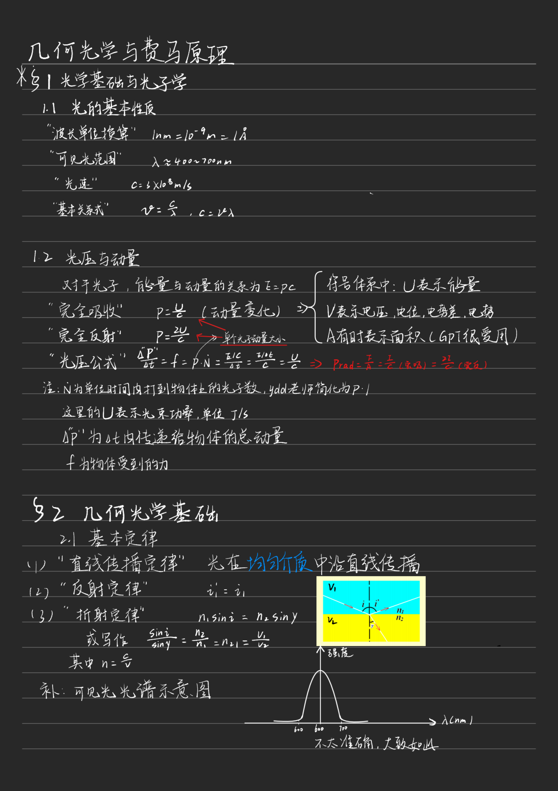
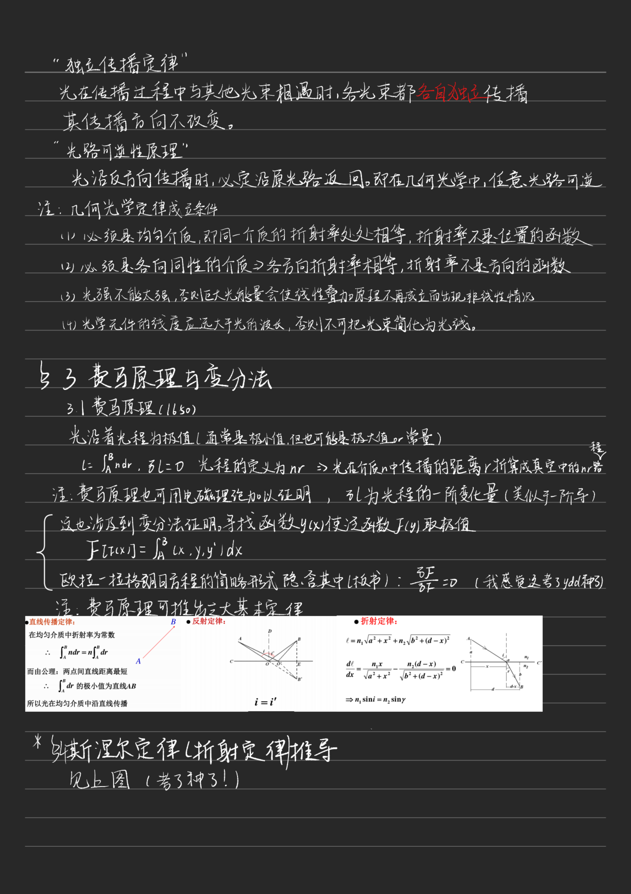
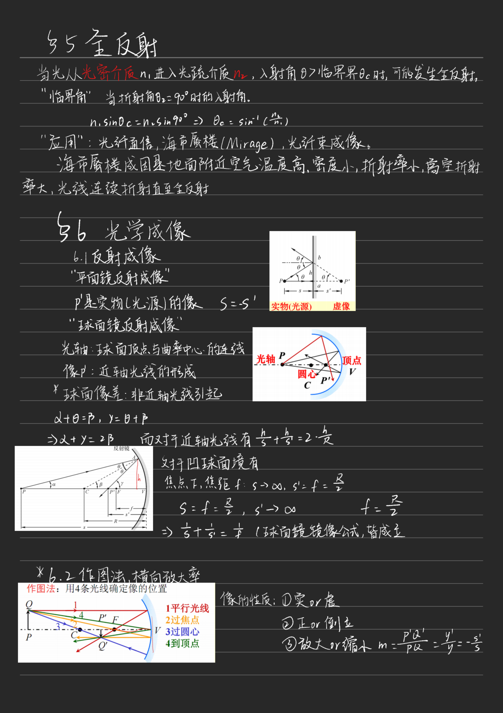
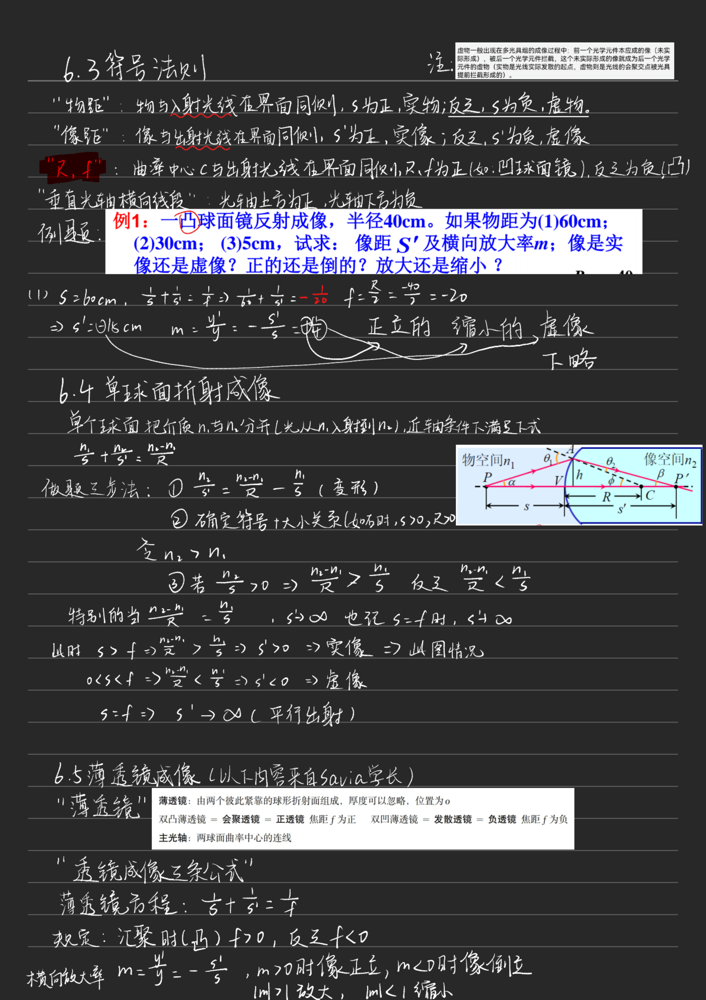
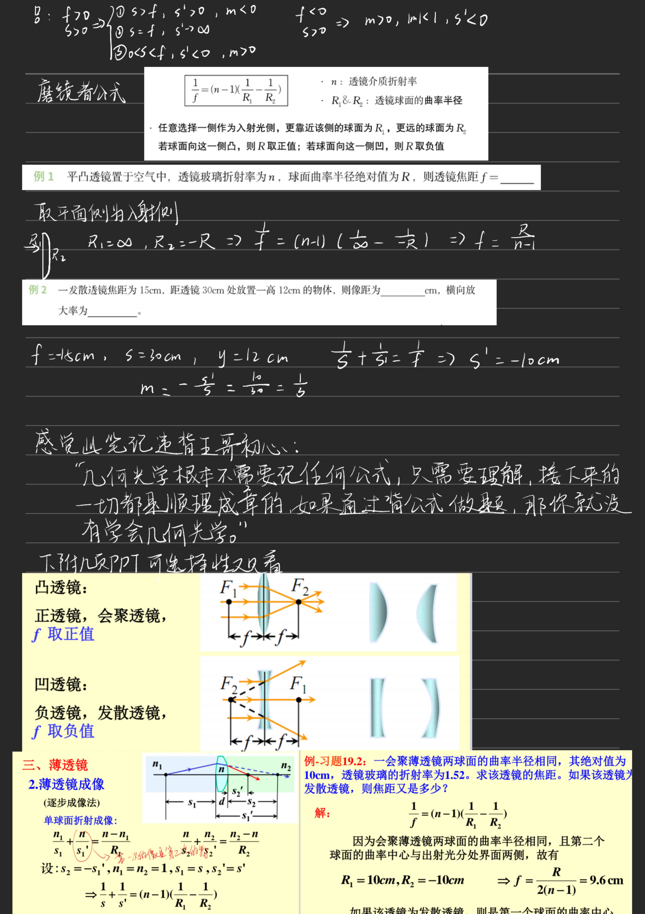
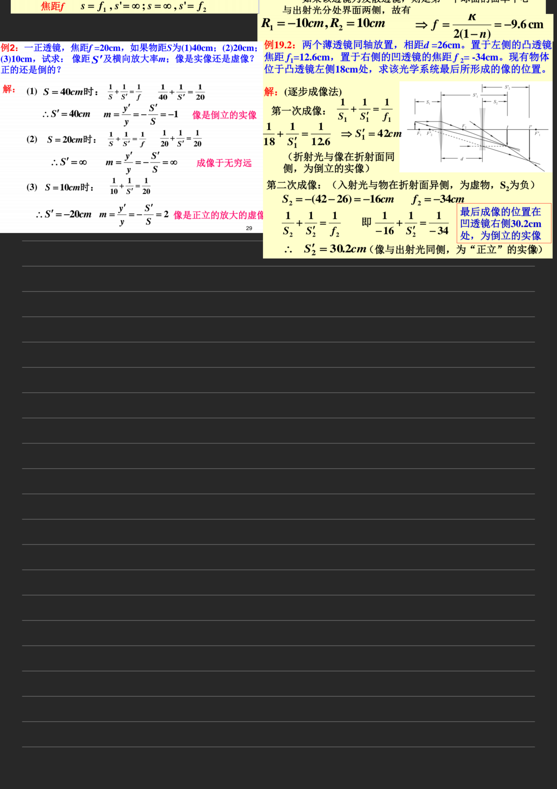

# 几何光学笔记

!!! info "文件说明"
    几何光学部分笔记，共 6 页。

=== ":material-file-pdf-box: PDF 预览"

    <iframe src="../geometrical-optics.pdf" width="100%" height="820px" frameborder="0"></iframe>

    [⬇ 下载 PDF](../geometrical-optics.pdf){ .md-button .md-button--primary }

=== ":material-image-multiple: 图片模式（iOS 可用）"

    > 共 6 页，4x 清晰度。

    
    
    
    
    
    
